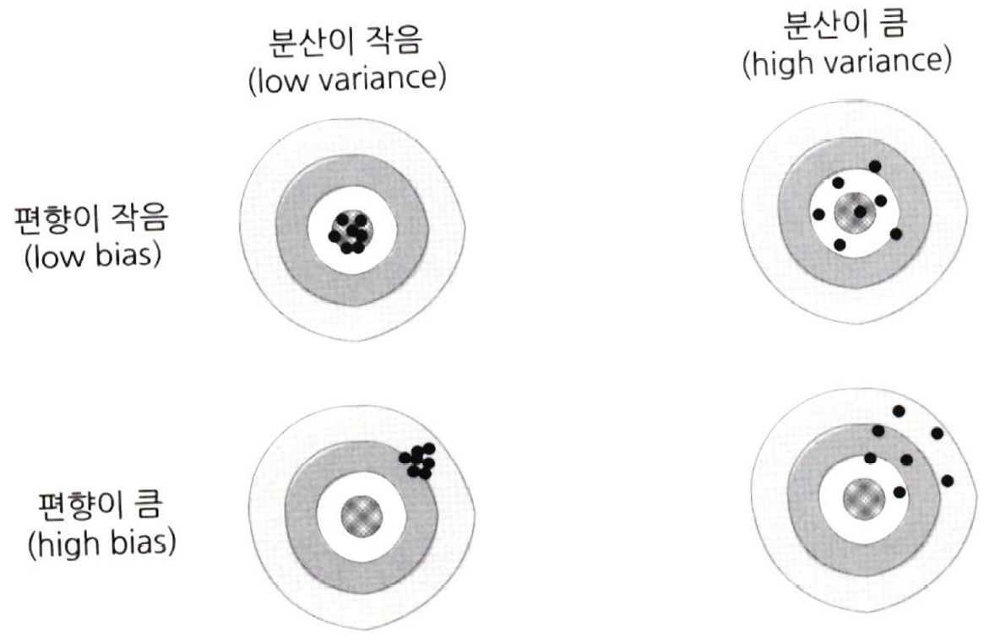
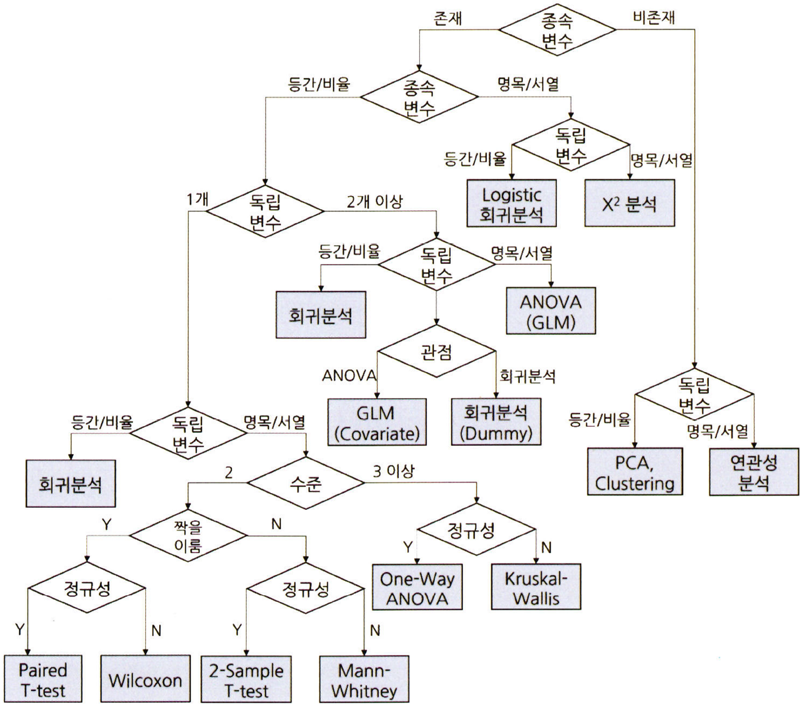
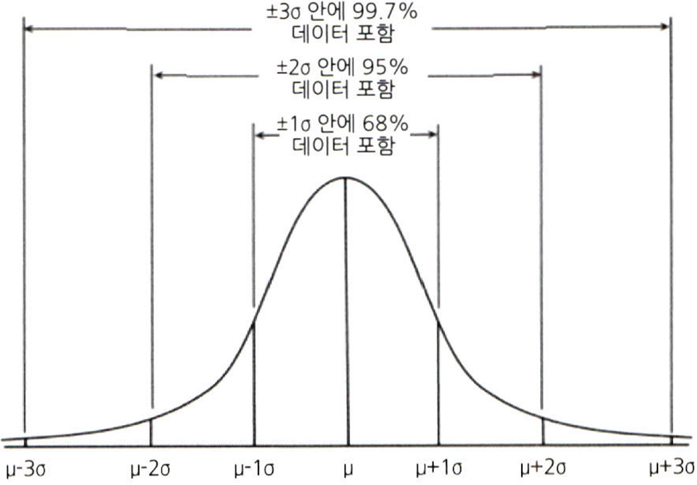
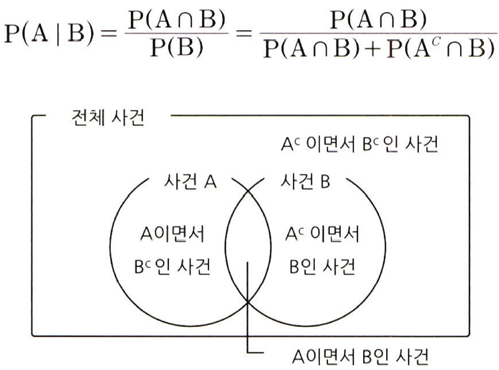

# 통계학 1주차 정규과제

📌통계학 정규과제는 매주 정해진 분량의 『*데이터 분석가가 반드시 알아야 할 모든 것*』 을 읽고 학습하는 것입니다. 이번 주는 아래의 **Statistics_1st_TIL**에 나열된 분량을 읽고 `학습 목표`에 맞게 공부하시면 됩니다.

아래의 문제를 풀어보며 학습 내용을 점검하세요. 문제를 해결하는 과정에서 개념을 스스로 정리하고, 필요한 경우 추가자료와 교재를 다시 참고하여 보완하는 것이 좋습니다.

1주차는 `1부. 데이터 기초체력 기르기`를 읽고 새롭게 배운 내용을 정리해주시면 됩니다.


## Statistics_1st_TIL

### 1부. 데이터 기초체력 기르기
### 01. 통계학 이해하기
### 02. 모집단과 표본추출
### 03. 변수와 척도
### 04. 데이터의 기술 통계적 측정
### 05. 확률과 확률변수

## Study Schedule

|주차 | 공부 범위     | 완료 여부 |
|----|----------------|----------|
|1주차| 1부 p.2~56     | ✅      |
|2주차| 1부 p.57~79    | 🍽️      | 
|3주차| 2부 p.82~120   | 🍽️      | 
|4주차| 2부 p.121~202  | 🍽️      | 
|5주차| 2부 p.203~254  | 🍽️      | 
|6주차| 3부 p.300~356  | 🍽️      | 
|7주차| 3부 p.357~615  | 🍽️      | 

<!-- 여기까진 그대로 둬 주세요-->

# 01. 통계학 이해하기

```
✅ 학습 목표 :
* 통계학의 필요성에 대해 인식한다.
* 기술통계와 추론통계의 특성을 구분할 수 있다.
```

<!-- 새롭게 배운 내용을 자유롭게 정리해주세요.-->
## 1.1 왜 통계학을 알아야 할까?
- 데이터 과학은 기초 통계로부터 발전해 왔으며, 그 의미를 해석함에 있어서도 통계 이론에 기반해야 함
- 분석 결과가 진정 의미가 있는 것인지, 잘못된 부분은 없는지, 있다면 어떻게 개선해야 하는지를 알 수 없기 때문임
> "읽기, 쓰기 능력과 마찬가지로 통계학적 사고 역시 사회인이 갖춰야 할 기본 교양이 될 것이다." -H. G 웰스-


## 1.2 머신러닝과 전통적 통계학의 차이


- 머신러닝의 주된 목적은 예측(Prediction)이고 통계학의 주된 목적은 해석(Explanation)임
    - **머신러닝**은 예측력이 얼마나 높은가에 집중함
    - 분석 모형의 복잡성(Complexity)이 높으며, 고질적인 문제인 과적합(Overfitting) 해결에 집중함
    - **통계학**은 모델의 신뢰도를 중시하며 복잡성보다는 단순성을 추구함
    - 확률을 통해 가설을 검증하고 추정 모델을 통해 데이터를 해석하는 것에 목적을 둠
- 통계학은 모델의 기초 체력과 같은 것이고 이를 바탕으로 복잡하고 정교한 머신러닝 모델을 만드는 것


### 1.3 통계학의 정의와 기원
> **통계학**: 자료를 수집, 분석하여 그 분석 결과를 통해 효율적인 의사결정을 하는 기법을 연구하는 학문

- 통계학은 인구조사를 하면서 생겨남(기원전 약 3000년경 이집트, 고대 로마 등 병사 징집 및 조세 수금 목적으로 시행)
- 17세기 수리적 기법이 견고해졌고 점자 학문적으로 자리 잡기 시작
- 영국의 상인 & 정치산술의 창시자 존 그랜트는 런던시 출생/사망에 대한 주간 기록표 23년 치 분석
    - 무역과 전염병 사이의 관계를 밝혀내기도 함

> `X(독립변수)`: 해당 지역의 월간 무역 횟수<br>
> `Y(종속변수)`: 해당 지역의 사망률<br>
> `H0(귀무가설)`: 해당 지역의 월간 무역 횟수는 사망률과 관련이 없다.<br>
> `H1(대립가설)`: 해당 지역의 월간 무역 횟수는 사망률에 (+) 영향을 미친다.


- **프랜시스 골턴**: 평균으로의 회귀(regression to the mean)를 발견
- **칼 피어슨**: 세상의 모든 사건은 독립적으로 일어나지만 서로 상관관계를 가지고 있으므로 상관관계를 맺는 두 변수 중에서 하나의 변수를 알면 다른 변수를 알 수 있다는 상관관계 계수(correlation coeffcient)의 개념을 창시
- **존 튜키**: 현대 데이터 과학의 토대가 되는 탐색적 데이터 분석(EDA) 분야를 창시

## 1.4 기술 통계화 추론 통계

### 기술 통계
> 문자 그대로 주어진 데이터의 특성을 사실에 근거하여 설명하고 묘사하는 것

- 전체 데이터를 쉽고 직관적으로 파악할 수 있도록 설명해 주는 것
- 평균(가중평균, 기하평균, 조화평균 등), 중앙값, 최빈값 등

### 추론 통계
> 표본 집단으로부터 모집단의 특성을 추론하는 것

- 표본의 특성을 분석 -> 특성의 일반화 여부 판단 -> 모집단의 특성으로 추정


# 02. 모집단과 표본추출

```
✅ 학습 목표 :
* 모집단과 표본의 정의와 관계를 설명할 수 있다.
* 편향과 분산의 차이를 설명할 수 있다.
```

<!-- 새롭게 배운 내용을 자유롭게 정리해주세요.-->
## 2.1 모집단과 표본, 전수조사와 표본조사
- **모집단**: 분석 대상 전체의 집합<br>
- **표본**: 모집단의 일부를 추출한 것<br>
- **전수조사**: 모집단의 자료 전체를 조사 및 분석하여 정보를 추출하는 것<br>
- **표본조사**: 모집단에서 추출한 표본을 통해 모집단의 정보를 추정하고 검정하는 것

- 최대한 모집단의 특성을 반영할 수 있도록 표본을 추출하는 노하우가 무엇보다 중요함

## 2.2 표본조사를 하는 이유와 데이터과학 적용 방법
- 최종 분석에는 전체 데이터를 사용하더라도, 분석 모델이 완성될 때까지는 표본 데이터를 활용하는 것이 경제적, 시간적으로 유리함
- 예측 및 분류 모델링 단계에서는 적절한 표본을 추출해서 진행하고 전체 프로세스가 완성됐을 때 전체의 데이터를 사용하여 최종적인 모델 성능을 확인하고 예측 및 분류를 하는 것이 좋음
- 모집단에 대한 정확한 파악이 불가능하거나 자동차 충격 테스트와 같은 파괴적인 조사를 해야 할 경우에도 표본조사를 해야 함

> **표지 재포획법(marking and recapture method)**
>
> *예)* 관악구의 길고양이 중 100마리를 포획한 뒤 알아볼 수 있는 표식을 남기고 풀어줌 -> 무작위로 100마리를 포획하여 저번에 남겼던 표식이 있는 고양이를 확인함 -> 표식이 있는 길고양이의 비율을 통해 관악구의 길고양이 모집단 수를 추정<br>
> $$\frac{100}{N} \approx \frac{n}{100}$$

## 2.3 표본추출에서 나타나는 편향의 종류
- **표본 오차**: 모집단과 표본의 자연 발생적인 변동<br>
- **비표본 오차**: 이를 제외한 변동<br>
- **편향**: 비표본 오차의 한 원인으로 표본에서 나타나는 모집단과의 체계적인 차이
    - **표본추출편향**: 표본 추출 과정에서 체계적인 경향이 개입되어 편향된 표본만 추출되는 경우
    - **가구편향**: 모집단의 부분 집단 단위에서 하나의 관측치씩 추출하는 경우 크고 적은 집단이 작고 많은 집단보다 적게 추출되는 경우
    - **무응답편향**: 설문에 응답하지 않는 사람들과 체계적인 차이가 있는 경우
    - **응답편향**: 설문 형식의 문제, 응답자의 심리적 이슈에 의해 표본이 영향을 받는 경우

- **브래들리 효과**: 여론 조사를 할 때 피조사자가 자신의 생각이나 신념을 밝히기 어려워하여 거짓된 응답을 하는 현상
- 사람들의 심리적인 조건에 따라 통계적 편향이 발생할 수 있음

## 2.4 인지적 편향의 종류
- "사람들은 언제나 합리적으로 생각하고 행동하는 것이 아니며, 휴리스틱을 통해 왜곡된 지각으로 결정을 하는 경우가 많다."

- **확증 편향**: 자신이 본래 믿고 있는 대로 정보를 선택적으로 받아들이고 임의로 판단하는 편향
- **기준점 편향**: 분석가가 가장 처음에 접하는 정보에 지나치게 매몰되는 편향
- **선택 지원 편향**: 본인이 의사결정을 내리는 순간 그 선택의 긍정적인 부분에 대해 더 많이 생각하고 그 결정에 반대되는 증거를 무시하게 되는 편향
- **분모 편향**: 분수 전체가 아닌 분자에만 집중하여 현황을 왜곡하여 판단하게 되는 편향
- **생존자 편향**: 소수의 성공한 사례를 일반화된 것으로 인식함으로써 나타나는 편향

## 2.5 머신러닝 모델 측면의 편향과 분산
- 편향과 분산은 트레이드오프 관계




## 2.6 표본 편향을 최소화하기 위한 표본 추출 방법
1. **모집단 확정:** 조사대상이 되는 사람, 사물, 조직, 지역 등의 전체 집합을 구체적으로 정의
2. **표본 프레임 결정**: 모집단에 포함되는 조사 대상의 목록 설정
3. **표본 추출방법 결정**: 확률표본추출과 비확률표본추출, 복원과 비복원 추출 중 적절한 방법 선택
4. **표본크기 결정**: 조사의 유형, 시간, 예산 등을 고려하여 추출할 표본의 크기를 결정
5. **표본추출**: 선정된 조사 대상들을 추출


# 03. 변수와 척도
```
✅ 학습 목표 :
* 독립변수, 종속변수의 관계를 파악할 수 있다.
* 척도(변수의 데이터적 속성)의 종류를 설명할 수 있다.
```

<!-- 새롭게 배운 내용을 자유롭게 정리해주세요.-->
## 3.1 변수의 종류
- 양적변수(이산변수/연속변수) & 질적변수
- 독립변수 & 종속변수

## 3.2 변수 관계의 종류
- **인과관계**: 독립변수와 종속변수의 기본적 관계<br>
- **상관관계**: 변수 간에 관련성이 존재하는 관계<br>
- **독립관계**: 변수 간에 상관성, 즉 상관계수가 0인 관계<br>
- **의사관계**: 변수 간에 상관성은 있지만, 그 상관성이 다른 변수에 의해 나타난 관계<br>
- **양방향적 인과관계**: 두 변수가 서로 간에 인과적 영향을 미치는 관계<br>
- **조절관계**: 독립변수와 종속변수 사이에서 강하고 불확정적인 영향을 미치는 관계
- **매개관계**: 독립변수와 종속변수의 중간에서 매개변수가 개입되어 독립변수의 영향을 종속변수에 전달하는 관계

## 3.3 척도의 종류



# 04. 데이터의 기술 통계적 측정

```
✅ 학습 목표 :
* 산포도의 의미를 설명하고 측정방법을 나열할 수 있다.
* 정규분포의 왜도값과 첨도값이 얼마인지 답할 수 있다.
```

<!-- 새롭게 배운 내용을 자유롭게 정리해주세요.-->
## 4.1 중심 성향의 측정
- **산술평균**: 등간척도나 비율척도로 측정된 데이터를 통해 전체 변숫값을 모두 더한 후 값들의 개수로 나눠줌<br>
- **가중평균**: 무거움을 더해서 평균을 구하는 방법<br>
- **기하평균**: 일반적으로 시간에 따라 비율적으로 변화하는 값의 평균을 구할 때 사용됨<br>
- **조화평균**: 시간적으로 변화하는 데이터에서 평균을 측정하는 방법

## 4.2 분산과 표준편차
> **자유도란?**
>
> 전체 관측치 중 하나는 정해진 표본평균을 맞춰줘야 하기 때문에 자유도를 박탈당함<br>
> 표본의 분산이 작게 계산되는 것을 완화하기 위해 나눠주는 값을 -1 해줌으로써 모수의 분산과 비슷하도록 조정을 해주는 것

## 4.3 산포도와 범위, 사분위수, 변동계수
- 변동 계수: 표준편차를 산술평균으로 나누어 준 값
    - 다른 두 자료의 산포도를 비교

## 4.4 왜도와 첨도

### 왜도
> 데이터 분포의 좌우 비대칭도를 표현하는 척도

$$\frac{3(\text{평균값} - \text{중앙값})}{\text{표본의 표준편차}} \quad \text{or} \quad \frac{3(\text{평균값} - \text{최빈값})}{\text{표본의 표준편차}}$$

### 첨도
> 분포가 정규분포보다 얼마나 뾰족하거나 완만한지의 정도를 나타내는 척도

$$\frac{\sum_{i=1}^{n} (관측치 - \text{표본평균})^4}
{\frac{\text{전체 관측치 수}}{(\text{표본분산})^2}} - 3 \quad (\text{경우에 따라})$$

## 4.5 표준편차의 경험법칙



# 05. 확률과 확률변수

```
✅ 학습 목표 :
* 확률변수의 개념과 종류를 설명할 수 있다.
* 심슨의 역설을 설명하고, 발생 원인을 식별하며, 이를 해결하기 위한 방안을 도출할 수 있다.
```

<!-- 새롭게 배운 내용을 자유롭게 정리해주세요.-->
## 5.1 확률의 기본 개념
- 확률이란 일정한 조건 안에서 특정 사건이 일어날 수 있는 가능성의 정도

## 5.2 확률의 종류
- **비조건 확률**: 아무런 조건이 없는 상황에서 사건이 일어날 확률
- **결합확률**: 표본공간 안에서 일어나는 사건 각각의 조합으로 이루어지는 확률
- **조건부 확률**: 하나의 사건이 먼저 발생했다는 조건이 전제된 상황에서 또 다른 사건이 발생할 확률

## 5.3 분할과 베이지안 이론

### 분할


### 베이지안 이론
> `P(A)`: A의 사전 확률<br>
> `P(B)`: B의 사전 확률<br>
> `P(B|A)`: 사건 A(원인)가 전제됐을 때 사건 B(결과)의 조건부확률(우도 확률, likelihood)<br>
> `P(A|B)`: 사건 B(결과)가 전제됐을 때 사건 A(원인)의 조건부확률(사후 확률, posterior)

- 사전확률 -> 새로운 정보(우도 확률) -> 베이즈 정리의 응용 -> 사후확률

## 5.4 확률변수의 개념과 종류
- 확률과 변수의 개념이 합쳐진 것
- 측정 값이 변할 수 있는 확률
- 이산확률변수 & 연속확률변수

## 5.5 심슨의 역설
> 데이터를 자세히 들여다보면 그 데이터의 세부 비중에 따라 전체 대표 확률이 왜곡되는 경우가 생길 수 있음<br>
> *예) 버클리 대학의 입학 차별*


# 확인 문제

## 문제 1.

> **🧚Q. 한 대형 병원이 두 명의 외과 의사(A와 B)의 수술 성공률을 비교하려고 한다. 과거 1년간의 데이터를 보면, A 의사의 전체 수술 성공률은 80%, B 의사의 전체 수술 성공률은 90%였다. 이 데이터를 본 병원 경영진은 A 의사의 실력이 B 의사보다 별로라고 판단하여 A 의사의 수술 기회를 줄이는 방향으로 정책을 조정하려 한다.
그러나 일부 의료진은 이 결론에 의문을 제기했다.
그들은 "단순한 전체 성공률이 아니라 더 세부적인 데이터를 분석해야 한다"고 주장했다.**

> **-A 의사의 실력이 실제로 B 의사보다 별로라고 결론짓는 것이 타당한가?   
-그렇지 않다면, 추가로 확인해야 할 정보는 무엇인가?**

<!--심슨의 역설을 이해하였는지 확인하기 위한 문제입니다-->

<!--학습한 개념을 활용하여 자유롭게 설명해 보세요. 구체적인 예시를 들어 설명하면 더욱 좋습니다.-->

```
이는 데이터를 자세히 분석하면, 세부적인 비율에 따라 전체 평균 성공률이 왜곡될 수 있는 심슨의 역설(Simpson's Paradox)의 대표적인 사례이다. 따라서 단순 성공률만을 근거로 의사의 실력을 판단하는 것은 타당하지 않다.

보다 정확한 평가를 위해서는 수술한 환자의 상태, 담당한 수술의 유형 및 난이도와 같은 세부적인 지표를 면밀히 검토해야 한다. 이를 바탕으로 공정한 비교가 이루어져야 하며, 충분한 분석 없이 특정 의사의 수술 기회를 줄이는 것은 성급한 결론일 수 있다.
```

### 🎉 수고하셨습니다.
