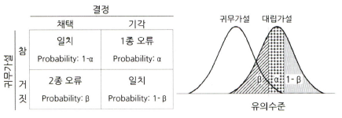

# 통계학 2주차 정규과제

📌통계학 정규과제는 매주 정해진 분량의 『*데이터 분석가가 반드시 알아야 할 모든 것*』 을 읽고 학습하는 것입니다. 이번 주는 아래의 **Statistics_2nd_TIL**에 나열된 분량을 읽고 `학습 목표`에 맞게 공부하시면 됩니다.

아래의 문제를 풀어보며 학습 내용을 점검하세요. 문제를 해결하는 과정에서 개념을 스스로 정리하고, 필요한 경우 추가자료와 교재를 다시 참고하여 보완하는 것이 좋습니다.

2주차는 `1부. 데이터 기초체력 기르기`를 읽고 새롭게 배운 내용을 정리해주시면 됩니다.


## Statistics_2nd_TIL

### 1부. 데이터 기초체력 기르기
### 06. 확률분포
### 07. 가설검정

## Study Schedule

|주차 | 공부 범위     | 완료 여부 |
|----|----------------|----------|
|1주차| 1부 p.2~56     | ✅      |
|2주차| 1부 p.57~79    | ✅      | 
|3주차| 2부 p.82~120   | 🍽️      | 
|4주차| 2부 p.121~202  | 🍽️      | 
|5주차| 2부 p.203~254  | 🍽️      | 
|6주차| 3부 p.300~356  | 🍽️      | 
|7주차| 3부 p.357~615  | 🍽️      |

<!-- 여기까진 그대로 둬 주세요-->

# 06. 확률분포

```
✅ 학습 목표 :
* 이산확률분포의 종류와 특징을 설명할 수 있다.
* 연속확률분포의 종류와 특징을 설명할 수 있다. 
* 중심극한정리(CLT)의 개념을 이해하고 설명 할 수 있다.
```

## 6.2. 이산확률분포

> **🧚 이산확률분포에 대해 학습한 내용을 정리해주세요.**

<!--수식과 공식을 암기하기보다는 분포의 개념과 특성을 위주로 공부해주세요. 분석 대상의 데이터가 어떠한 확률분포의 특성을 가지고 있는지를 아는 것이 더 중요합니다.-->

### 6.2.1 균등분포
> X가 동일한 확률을 가지는 분포

### 6.2.2 이항분포
> 동전의 앞뒤 혹은 성공/실패와 같이 1과 0의 값만을 갖는 분포

**베르누이 시행(Bernoulli trial):**
- 이항분포를 나타낼 수 있는, 결과가 두 가지 중 하나만 나오는 시행을 뜻함
- 일반적으로 시행의 성공에는 1을, 실패에 0을 대응시킴
- 각각의 결과가 독립적으로 이루어지기 때문에 처음에 0이 나왔다고 해서 다음에 나올 값에 영향을 받지 않음
- 1이 나올 확률과 0이 나올 확률의 합은 항상 1(100%)이 됨

---
$$P(X = k) = \frac{n!}{k!(n - k)!} \cdot p^k \cdot (1 - p)^{n - k}$$

- $n$: 전체 시행 횟수
- $X$: 성공 횟수를 나타내는 이항확률변수
- $k$: 성공 횟수
- $p$: 성공 확률
- 각 시행은 상호독립적임
- 성공확률 $p$는 매 시행마다 동일함
- 전체 시행 횟수 $n$은 사전에 정해져 있음

### 6.2.3 초기하분포
> 이항분포(베르누이 시행)과 달리, 각 시행이 서로 독립적이지 않아서 시행마다 성공할 확률이 달라짐 -> 비복원추출

### 6.2.4 포아송분포
> 일정한 관측 공간에서 특정 사건이 발생하는 횟수를 나타내는 이산확률분포

- 발생하는 사건은 양의 정수 형태를 가짐
- 모든 사건은 독립적으로 발생함
- 해당 시공간에서 사건의 발생 비율은 항상 같음(시공간이 두 배로 늘어나면 발생하는 사건도 두 배로 늘어남)
- 한 번에 둘 이상의 사건이 발생하지 않음

**람다($\lambda$):** 일정 시공간에서의 평균 사건 발생 횟수

---
$$P(X = x) = \frac{e^{-\lambda} \lambda^x}{x!}$$

- $x$: 특정 시공간 안에서 발생한 사건의 수
- $e$: 자연로그의 밑수 (약 2.71828)
- $\lambda$: 특정 시공간 안에서의 평균 사건 발생 횟수


## 6.3. 연속확률분포

> **🧚 연속확률분포에 대해 학습한 내용을 정리해주세요.**

<!--수식과 공식을 암기하기보다는 분포의 개념과 특성을 위주로 공부해주세요. 분석 대상의 데이터가 어떠한 확률분포의 특성을 가지고 있는지를 아는 것이 더 중요합니다.-->

- 연속형 확률분포는 확률밀도함수를 통해 전체 분포 중 특정 면적을 적분을 통해 분리하여 면적의 구간 안에서 사건이 발생할 확률을 계산

### 6.3.1 정규분포
> 가장 대표적인 연속확률 분포

- 평균을 중심으로 좌우 대칭의 종 모양의 형태를 가지고 있음 => 평균 & 중앙값 & 최빈값 같음


=> 표준편차의 경험법칙과 유사

**표준정규분포:**
- 각기 다른 정규분포간 비교의 동질성을 만들기 위해 평균이 0, 분산이 1인 표준정규분포의 형태로 변환
- 확률변수 $X$의 편차($X - \mu$)를 표준편차($\sigma$)로 나누어 확률변수를 표준화한 값($Z$)으로 변환
- 정규분포상의 구간확률을 쉽게 구하고 비교할 수 있음

### 6.3.2 지수분포
> 특정 사건이 발생한 시점으로부터 다음 사건이 발생할 때까지의 시간을 확률변숫값으로 하는 분포를 뜻함

**확률밀도함수**
$$f(t) = \lambda e^{-\lambda t}$$
- $t$: 시점(time)을 나타내는 변수로, 사건과 다음 사건 사이의 시간의 확률변수 $(t>0)$
- $e$: 자연로그의 밑수(2.71828)
- $\lambda$: 특정 시공간 안에서의 평균 사건 발생 횟수

---
- 지수분포의 (소요시간) 평균: $\mu = \frac{1}{\lambda}$
- 지수분포의 (소요시간) 분산: $\sigma^2=\frac{1}{\lambda^2}$
- 지수분포의 (소요시간) 표준편차: $\sigma = \sqrt{\frac{1}{\lambda^2}} $

---
1. t 시점 이전에 발생할 확률($1-e^{-\lambda t}$)
2. t 시점 이후에 발생할 확률($e^{-\lambda t}$)
3. t 시점 t' 시점 사이에 발생할 확률$(-e^{-\lambda t}) - (-e^{-\lambda t'}) = e^{-\lambda t} - e^{-\lambda t'}$


## 6.4. 중심극한정리

> **🧚 중심극한정리에 대해 학습한 내용을 정리해주세요.**

> 데이터의 크기(n)가 일정한 양(예를 들어 30개)을 넘으면, 평균의 분포는 정규분포에 근사한다는 이론

- 표본을 여러 번 추출했을 때, '각각의 표본' 평균들의 분포가 정규분포를 이룬다는 것


- 모집단 분포가 심하게 치우쳐 있거나 극단적인 경우에는 표본 평균의 정규 분포를 달성하기 위해 더 많은 표본이 필요할 수 있음


# 07. 가설검정

```
✅ 학습 목표 :
* 귀무가설과 대립가설의 개념을 정의하고, 주어진 연구 질문에 적절한 가설을 설정할 수 있다.
* 가설검정의 유의수준과 p값의 개념을 설명하고, p값을 해석하여 귀무가설을 기각할지 여부를 판단할 수 있다.
* 1종 오류와 2종 오류의 차이를 설명하고, 실제 사례에서 어떤 오류를 더 중요하게 고려해야 하는지 판별할 수 있다.
```

<!-- 새롭게 배운 내용을 자유롭게 정리해주세요.-->

### 7.1 귀무가설과 대립가설

**가설:** 둘 혹은 그 이상의 변수들 간의 관계에 대한 잠정적 결론

---
- **기술적 분석:** 과거나 현재에 어떤 일이 일어났는지를 파악하기 위한 분석 / 데이터의 분포, 추세 등을 분석하여 상황을 모니터링함
- **진단적 분석:** 과거나 현재에 발생한 사건의 원인을 밝히기 위한 분석 / 데이터 간의 관계를 분석하여 인과관계를 찾음
- **예측 분석:** 기계학습 모델 등을 사용하여, 미래에 어떤 일이 어느 정도의 확률로 일어날지를 예측 / 현재는 알 수 없는 결과의 가능성을 파악함
- **처방적 분석:** 예측되는 미래의 결과를 위해 어떻게 하면 좋을지 처방하기 위한 분석 / 제한된 자원을 효과적으로 활용하여 최적의 성과를 낼 수 있도록 방향을 도출함


---
- **귀무가설($H_0$):** 증명하고자 하는 가설과 반대되는 가설로써, 효과와 차이가 없는 가설을 의미
- **대립가설($H_1/H_a$):** 귀무가설이 기각됐을 때 대안적으로 채택되는 가설(귀무가설과 반대되는 가설)

### 7.2 가설검정의 절차

1. 가설 설정
2. 유의수준 설정
3. 실험 수행
4. 검정 통계량 산출
5. 대립가설 기각/채택


### 7.3 가설검정의 유의수준과 p값

- 가설검정은 모집단에서 표본을 추출하여 얻은 표본 통계량으로 모집단의 모수가 귀무가설과 맞지 않고 연구가설에 합당한지 판단하기 위한 평가 방법


=> 표본의 검정 통계량이 분포상 어디에 들어가는가에 따라 귀무가설을 채택할지 기각할지 판단함

- 가설검정은 귀무가설의 기각역을 어느 쪽으로 설정하는가에 따라 단측 검정(왼쪽꼬리 검정/오른쪽 꼬리 검정), 그리고 양측 검정으로 구분됨


### 7.4 1종 오류와 2종 오류
> **1종 오류:** 귀무가설이 참임에도 불구하고 귀무가설을 기각하는 오류<br>
> (실제로 효과가 없는데 효과가 있다고 판단)<br>
>**2종 오류:** 귀무가설이 거짓임에도 불구하고 귀무가설을 채택하는 오류<br>
> (실제로 효과가 있는데 효과가 없다고 판단)

- $\alpha$ -> 1종 오류가 발생할 확률
- $\beta$ -> 2종 오류가 발생할 확률
- $\alpha$와 $\beta$값은 서로 트레이드오프 관계임



- 일반적으로 유의수준($\alpha$)은 0.05, 1-검정력($\beta$)은 0.2 기준을 사용함
- 1종 오류를 2종 오류보다 더 중요하게 생각함


# 확인 문제

## 문제 1.

> **🧚Q. 다음 중 귀무가설(H₀)을 기각해야 하는 경우는 언제인가요? 정답을 고르고, 그 이유를 간단히 설명해주세요.**

> **1️⃣ 유의수준(α)이 0.05이고, p값이 0.03일 때   
2️⃣ 유의수준(α)이 0.01이고, p값이 0.02일 때**

```
1번 -> p값 0.03이 유의수준 0.05보다 작기 때문에 귀무가설을 기각해야 함
```

### 🎉 수고하셨습니다.