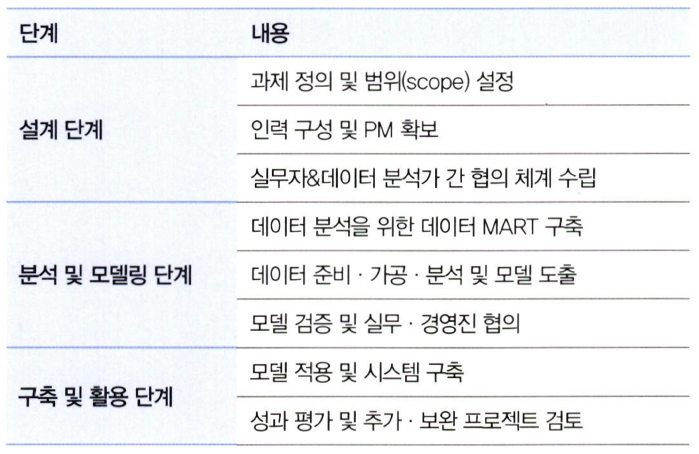
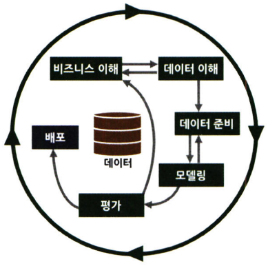

# 통계학 3주차 정규과제

📌통계학 정규과제는 매주 정해진 분량의 『*데이터 분석가가 반드시 알아야 할 모든 것*』 을 읽고 학습하는 것입니다. 이번 주는 아래의 **Statistics_3rd_TIL**에 나열된 분량을 읽고 `학습 목표`에 맞게 공부하시면 됩니다.

아래의 문제를 풀어보며 학습 내용을 점검하세요. 문제를 해결하는 과정에서 개념을 스스로 정리하고, 필요한 경우 추가자료와 교재를 다시 참고하여 보완하는 것이 좋습니다.

2주차는 `2부-데이터 분석 준비하기`를 읽고 새롭게 배운 내용을 정리해주시면 됩니다.


## Statistics_3rd_TIL

### 2부. 데이터 분석 준비하기
### 08. 분석 프로젝트 준비 및 기획
### 09. 분석 환경 세팅하기


## Study Schedule

|주차 | 공부 범위     | 완료 여부 |
|----|----------------|----------|
|1주차| 1부 p.2~56     | ✅      |
|2주차| 1부 p.57~79    | ✅      | 
|3주차| 2부 p.82~120   | ✅      | 
|4주차| 2부 p.121~202  | 🍽️      | 
|5주차| 2부 p.203~254  | 🍽️      | 
|6주차| 3부 p.300~356  | 🍽️      | 
|7주차| 3부 p.357~615  | 🍽️      |  

<!-- 여기까진 그대로 둬 주세요-->

# 08. 분석 프로젝트 준비 및 기획

```
✅ 학습 목표 :
* 데이터 분석 프로세스를 설명할 수 있다.
* 비즈니스 문제를 정의할 때 주의할 점을 설명할 수 있다.
* 외부 데이터를 수집하는 방법에 대해 인식한다.
```
<!-- 새롭게 배운 내용을 자유롭게 정리해주세요.-->

## 8.1 데이터 분석의 전체 프로세스

### 8.1.1 데이터 분석의 3단계

**데이터 분석의 궁극적인 목표**
- 의사결정 프로세스의 최적화
- 효과적인 결정을 할 수 있도록 도움을 주는 것



### 8.1.2 CRISP-DM 방법론



```js
1. 비즈니스 이해
-> 현재 상황 평가
-> 데이터 마이닝 목표 결정
-> 프로젝트 계획 수립

2. 데이터 이해
-> 데이터 설명
-> 데이터 탐색
-> 데이터 품질 확인

3. 데이터 준비
-> 데이터 선택
-> 데이터 정제
-> 필수 데이터 구성
-> 데이터 통합

4. 모델링
-> 모델링 기법 선정
-> 테스트 디자인 생성
-> 모델 생성
-> 모델 평가

5. 평가
-> 결과 평가
-> 프로세스 검토
-> 다음 단계 결정

6. 배포
-> 배포 계획
-> 모니터링 및 유지 관리 계획
-> 최종 보고서 작성
-> 프로젝트 검토
```

### 8.1.3 SAS SEMMA 방법론


```js
1. Sampling 단계
-> 전체 데이터에서 분석용 데이터 추출
-> 의미 있는 정보를 추출하기 위한 데이터 분할 및 병합
-> 표본추출을 통해 대표성을 가진 분석용 데이터 생성
-> 분석 모델 생성을 위한 학습, 검증, 테스트 데이터셋 분할

2. Exploration 단계
-> 통계치 확인, 그래프 생성 등을 통해 데이터 탐색
-> 상관분석, 클러스터링 등을 통해 변수 간의 관계 파악
-> 분석 모델에 적합한 변수 선정
-> 데이터 현황을 파악하여 비즈니스 아이디어 도출 및 분석 방향 수정

3. Modification 단계
-> 결측값 처리 및 최종 분석 변수 선정
-> 로그변환, 구간화 등 데이터 가공
-> 주성분분석 등을 통해 새로운 변수 생성

4. Modeling 단계
-> 다양한 데이터마이닝 기법 적용에 대한 적합성 검토
-> 비즈니스 목적에 맞는 분석 모델을 선정하여 분석 알고리즘 적용
-> 지도학습, 비지도학습, 강화학습 등 데이터 형태에 따라 알맞은 모델 선정
-> 분석 환경 인프라 성능과 모델 정확도를 고려한 모델 세부 옵션 설정

5. Assessment 단계
-> 구축한 모델들의 예측력 등 성능을 비교, 분석, 평가
-> 비즈니스 상황에 맞는 적정 임계치 설정
-> 분석 모델 결과를 비즈니스 인사이트에 적용
-> 상황에 따라 추가적인 데이터 분석 수행
```

---


> - 초반부에는 비즈니스 문제와 해결 방향을 명확히 정의하고 데이터를 탐색
> - 중반부에는 데이터를 목적에 맞도록 수집 및 가공하고 필요에 따라 머신러닝 모델을 사용
> - 후반부에는 데이터 분석 결과를 검토 및 검증하고 실제 환경에 적용
> - 이후에는 적용한 방법의 효과를 지속적으로 모니터링하고 성과를 측정하고 보완하는 단계가 수반되어야 함

## 8.2 비즈니스 문제 정의와 분석 목적 도출

**채찍 효과:**<br>
-> 공급사슬에서 수요 변동의 단계적 증폭 현상을 표현하는 용어<br>
-> 긴 채찍을 휘두르면 손잡이 부분에서 작은 흔들림만 있어도 끝부분에서는 커다란 파동이 생기는 현상을 빗댄 표현<br>
-> 비즈니스 이해 및 문제 정의가 조금이라도 잘못되면 최종 인사이트 도출 및 솔루션 적용 단계에서 제대로 된 효과를 보기 힘듬

**MECE(Mutually Exclusive Collectively Exhaustive):**<br>
세부 정의들이 서로 겹치지 않고 전체를 합쳤을 때는 빠진 것 없이 완전히 전체를 이루는 것


=> 비즈니스 문제는 현상에 대한 설명으로 끝나서는 안 되고, 본질적인 문제점이 함께 전달되어야 하는 것


> **페이오프 매트릭스:**<br>
> GE에서 개발한 문제해결 우선순위 결정방식으로 과제의 수익성과 실행 가능성 수준에 따라 2x2 네 개의 분면에 과제 우선순위를 표현함

## 8.3 분석 목적의 전환

- 분석 프로젝트의 방향이 언제든 바뀔 수 있다는 것을 염두에 두어야 함
- 분석 프로젝트를 수행하는 동안에는 실무자들 간의 커뮤니케이션 및 협력이 매우 중요함
    - 초기 데이터 탐색을 통해 도출할 수 있는 간단한 상관관계나 데이터 특성 그리고 시각화를 적극 활용해야 함

## 8.4 도메인 지식

- **도메인 지식**이란 해당되는 분야의 업에 대한 이해도
- 직접 의미 있는 변수를 찾아내고 분석 방향을 설정하는 것은 도메인 지식이 충분하게 수반됐을 때 가능

**도메인 지식의 효과적인 습득 방법**
```js
1. 프로젝트 초반에, 비즈니스 도메인에 소속된 실무자와 잦은 미팅과 함께 적극적인 질문과 자료 요청이 필요함
2. 관련 논문들을 참고하여 해당 도메인에 대한 심도 있는 지식을 습득하는 것
3. 현장에 방문해 데이터가 만들어지는 과정을 직접 보는 것
```

- 기본적으로 데이터가 생성되는 현장을 직접 보고 소비자 혹은 사용자의 입장이 되어 경험을 해보는 것이 좋음

## 8.5 외부 데이터 수집과 크롤링


# 09. 분석 환경 세팅하기

```
✅ 학습 목표 :
* 데이터 분석의 전체적인 프로세스를 설명할 수 있다.
* 테이블 조인의 개념과 종류를 이해하고, 각 조인 방식의 차이를 구분하여 설명할 수 있다.
* ERD의 개념과 역할을 이해하고, 기본 구성 요소와 관계 유형을 설명할 수 있다.
```

<!-- 새롭게 배운 내용을 자유롭게 정리해주세요.-->


<br>
<br>

# 확인 문제

## 문제 1.

> **🧚 아래의 테이블을 조인한 결과를 출력하였습니다. 어떤 조인 방식을 사용했는지 맞춰보세요.**

> 사용한 테이블은 다음과 같습니다.

|
---|---|

> 보기: INNER, LEFT, RIGHT 조인

<!-- 테이블 조인의 종류를 이해하였는지 확인하기 위한 문제입니다. 각 테이블이 어떤 조인 방식을 이용하였을지 고민해보고 각 테이블 아래에 답을 작성해주세요.-->

### 1-1. 

```
여기에 답을 작성해주세요!
```

### 1-2. 

```
여기에 답을 작성해주세요!
```

### 1-3. 

```
여기에 답을 작성해주세요!
```

### 🎉 수고하셨습니다.
