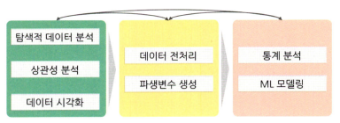
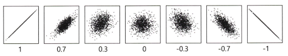

# 통계학 4주차 정규과제

📌통계학 정규과제는 매주 정해진 분량의 『*데이터 분석가가 반드시 알아야 할 모든 것*』 을 읽고 학습하는 것입니다. 이번 주는 아래의 **Statistics_4th_TIL**에 나열된 분량을 읽고 `학습 목표`에 맞게 공부하시면 됩니다.

아래의 문제를 풀어보며 학습 내용을 점검하세요. 문제를 해결하는 과정에서 개념을 스스로 정리하고, 필요한 경우 추가자료와 교재를 다시 참고하여 보완하는 것이 좋습니다.

4주차는 `2부. 데이터 분석 준비하기`를 읽고 새롭게 배운 내용을 정리해주시면 됩니다.


## Statistics_4th_TIL

### 2부. 데이터 분석 준비하기
### 10. 데이터 탐색과 시각화


## Study Schedule

|주차 | 공부 범위     | 완료 여부 |
|----|----------------|----------|
|1주차| 1부 p.2~56     | ✅      |
|2주차| 1부 p.57~79    | ✅      | 
|3주차| 2부 p.82~120   | ✅      | 
|4주차| 2부 p.121~202  | ✅      | 
|5주차| 2부 p.203~254  | 🍽️      | 
|6주차| 3부 p.300~356  | 🍽️      | 
|7주차| 3부 p.357~615  | 🍽️      | 

<!-- 여기까진 그대로 둬 주세요-->

# 10. 데이터 탐색과 시각화

```
✅ 학습 목표 :
* EDA의 목적을 설명할 수 있다.
* 주어진 데이터셋에서 이상치, 누락값, 분포 등을 식별하고 EDA 결과를 바탕으로 데이터셋의 특징을 해석할 수 있다.
* 공분산과 상관계수를 활용하여 두 변수 간의 관계를 해석할 수 있다.
* 적절한 시각화 기법을 선택하여 데이터의 특성을 효과적으로 전달할 수 있다.
```
<!-- 새롭게 배운 내용을 자유롭게 정리해주세요.-->

## 10.1 탐색적 데이터 분석



- EDA를 할 때는 극단적인 해석은 피해야 하며 지나친 추론이나 자의적 해석도 지양해야 함

**EDA를 하는 주요 목적**
- 데이터의 형태와 척도가 분석에 알맞게 되어있는지 확인(sanity checking)
- 데이터의 평균, 분산, 분포, 패턴 등의 확인을 통해 데이터 특성 파악
- 데이터의 결측값이나 이상치 파악 및 보완
- 변수 간의 관계성 파악
- 분석 목적과 방향성 점검 및 보정

### 10.1.1 엑셀을 활용한 EDA

- EDA를 하는 가장 간단하면서 효과적인 방법은 **각 데이터 샘플을 1000개씩 뽑아서 엑셀에 붙여 놓고 변수와 설명 리스트와 함께 눈으로 쭉 살펴보는 것**
- 파이썬, R, SAS 등의 데이터 가공 및 시각화 기능이 아무리 좋다 하더라도 적은 데이터를 다룰 때는 엑셀만큼 사용자 친화적이고 효율적인 프로그램이 없음

### 10.1.2 탐색적 데이터 분석 실습

- `head` 메서드로 데이터가 제대로 로드됐는지 확인함
- `info()` 함수는 데이터에 대한 전반적인 정보를 나타냄
- `describe()`는 평균, 표준편차, 최대 최솟값 등을 한 번에 확인할 수 있는 매우 유용한 함수
- 왜도는 `skew()` 첨도는 `kurtosis()` 함수로 간단히 확인할 수 있음
- `seaborn`의 `distplot()` 함수로 확인하고자 하는 칼럼의 분포를 시각화함
- `violinplot()` 함수는 분포를 효과적으로 표현해 주며 `stripplot()` 함수는 각 관측치의 위치를 직관적으로 표현해 줌


## 10.2 공분산과 상관석 분석

- 타깃 변수 Y와 입력변수 X와의 관계는 물론 입력변수 X들 간의 관계도 살펴봐야 함

### 10.2.1 공분산

- **공분산:** 서로 공유하는 분산 / 두 분산의 관계

$$\mathrm{COV}(X_1, X_2) = \frac{\sum (\text{각 } X_1 \text{의 편차})(\text{각 } X_2 \text{의 편차})}{n (- 1)} = \frac{1}{n (- 1)} \sum (X_{1i} - \bar{x}_1)(X_{2i} - \bar{x}_2)$$

### 10.2.2 상관계수

- 각 변수 간의 다른 척도기준이 그대로 반영되어 공분산 값이 지니는 크기가 상관성의 정도를 나타내지 못함
    - *예:* $X_1$과 $X_2$의 공분산 값이 **1300**, $X_3$과 $X_4$의 공분산 값이 **800**이라 하더라도, $X_1$과 $X_2$의 **상관관계가 더 크다**고 단정할 수 없음

=> 이러한 한계를 해결하기 위해,  보편적으로는 **피어슨(Pearson) 상관계수**를 사용하여 변수 간의 선형 관계를 비교함
$$P(X_1, X_2) = \frac{\mathrm{COV}(X_1, X_2)}{\sqrt{\mathrm{Var}(X_1) \cdot \mathrm{Var}(X_2)}}$$



- 산점도의 기울기와 상관계수는 관련이 없음
- 분산의 관계성이 같다면, 기울기가 크든 작든 상관계수는 같음

**변수 척도에 따른 상관분석 방법**
| 종류                                | 척도                                  |
|-------------------------------------|----------------------------------------|
| Pearson correlation coefficient     | 간격/비율 – 간격/비율                  |
| Spearman's rank correlation coefficient | 서열 – 서열                          |
| Point–biserial correlation coefficient | 간격/비율 – 명목(2분 변수)           |
| Phi coefficient                     | 명목(2분 변수) – 명목(2분 변수)       |
| Cramer's coefficient                | 명목 – 명목 (2 x 2 이상)              |

### 10.2.3 공분산과 상관성 분석 실습


<br>
<br>

# 확인 문제

## 문제 1.
> **🧚 공분산과 상관계수의 차이점에 대해 간단히 설명하세요.**

```
여기에 답을 작성해주세요!
```

## 문제 2.
> **🧚 다음 데이터 분석 목표에 적합한 시각화 방법을 보기에서 모두 골라 연결해주세요.**

> 보기: 산점도, 선그래프, 막대그래프, 히스토그램, 박스플롯

(a) 변수의 분포 확인   
(b) 두 변수 간의 관계 확인   
(c) 집단별 평균 비교   
(d) 시계열 데이터 분석

<!--중복 가능-->

```
여기에 답을 작성해주세요!
```


### 🎉 수고하셨습니다.
