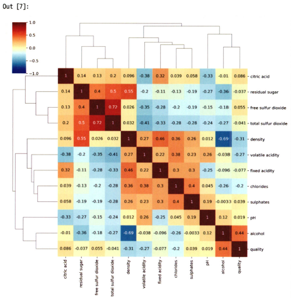
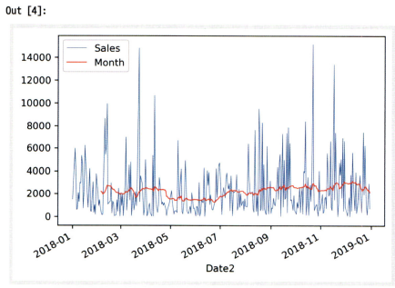
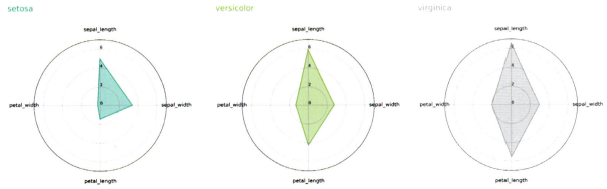
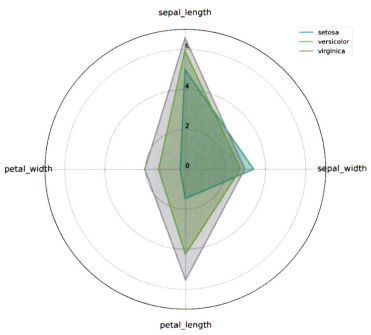
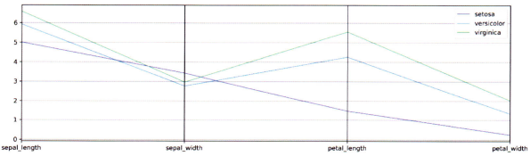
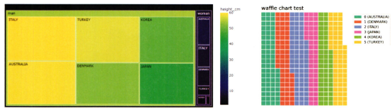
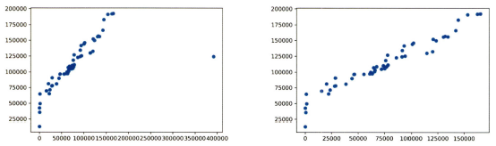
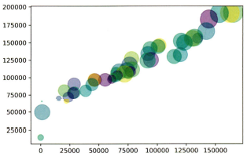
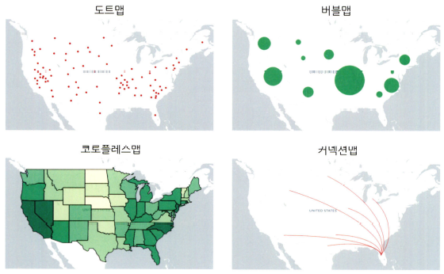
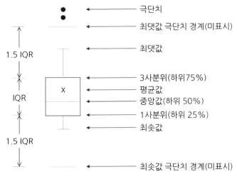

# 통계학 4주차 정규과제

📌통계학 정규과제는 매주 정해진 분량의 『*데이터 분석가가 반드시 알아야 할 모든 것*』 을 읽고 학습하는 것입니다. 이번 주는 아래의 **Statistics_4th_TIL**에 나열된 분량을 읽고 `학습 목표`에 맞게 공부하시면 됩니다.

아래의 문제를 풀어보며 학습 내용을 점검하세요. 문제를 해결하는 과정에서 개념을 스스로 정리하고, 필요한 경우 추가자료와 교재를 다시 참고하여 보완하는 것이 좋습니다.

4주차는 `2부. 데이터 분석 준비하기`를 읽고 새롭게 배운 내용을 정리해주시면 됩니다.


## Statistics_4th_TIL

### 2부. 데이터 분석 준비하기
### 10. 데이터 탐색과 시각화


## Study Schedule

|주차 | 공부 범위     | 완료 여부 |
|----|----------------|----------|
|1주차| 1부 p.2~56     | ✅      |
|2주차| 1부 p.57~79    | ✅      | 
|3주차| 2부 p.82~120   | ✅      | 
|4주차| 2부 p.121~202  | ✅      | 
|5주차| 2부 p.203~254  | 🍽️      | 
|6주차| 3부 p.300~356  | 🍽️      | 
|7주차| 3부 p.357~615  | 🍽️      | 

<!-- 여기까진 그대로 둬 주세요-->

# 10. 데이터 탐색과 시각화

```
✅ 학습 목표 :
* EDA의 목적을 설명할 수 있다.
* 주어진 데이터셋에서 이상치, 누락값, 분포 등을 식별하고 EDA 결과를 바탕으로 데이터셋의 특징을 해석할 수 있다.
* 공분산과 상관계수를 활용하여 두 변수 간의 관계를 해석할 수 있다.
* 적절한 시각화 기법을 선택하여 데이터의 특성을 효과적으로 전달할 수 있다.
```
<!-- 새롭게 배운 내용을 자유롭게 정리해주세요.-->

## 10.1 탐색적 데이터 분석


- EDA를 할 때는 극단적인 해석은 피해야 하며 지나친 추론이나 자의적 해석도 지양해야 함

**EDA를 하는 주요 목적**
- 데이터의 형태와 척도가 분석에 알맞게 되어있는지 확인(sanity checking)
- 데이터의 평균, 분산, 분포, 패턴 등의 확인을 통해 데이터 특성 파악
- 데이터의 결측값이나 이상치 파악 및 보완
- 변수 간의 관계성 파악
- 분석 목적과 방향성 점검 및 보정

### 10.1.1 엑셀을 활용한 EDA

- EDA를 하는 가장 간단하면서 효과적인 방법은 **각 데이터 샘플을 1000개씩 뽑아서 엑셀에 붙여 놓고 변수와 설명 리스트와 함께 눈으로 쭉 살펴보는 것**
- 파이썬, R, SAS 등의 데이터 가공 및 시각화 기능이 아무리 좋다 하더라도 적은 데이터를 다룰 때는 엑셀만큼 사용자 친화적이고 효율적인 프로그램이 없음

### 10.1.2 탐색적 데이터 분석 실습

- `head` 메서드로 데이터가 제대로 로드됐는지 확인함
- `info()` 함수는 데이터에 대한 전반적인 정보를 나타냄
- `describe()`는 평균, 표준편차, 최대 최솟값 등을 한 번에 확인할 수 있는 매우 유용한 함수
- 왜도는 `skew()` 첨도는 `kurtosis()` 함수로 간단히 확인할 수 있음
- `seaborn`의 `distplot()` 함수로 확인하고자 하는 칼럼의 분포를 시각화함
- `violinplot()` 함수는 분포를 효과적으로 표현해 주며 `stripplot()` 함수는 각 관측치의 위치를 직관적으로 표현해 줌


## 10.2 공분산과 상관석 분석

- 타깃 변수 Y와 입력변수 X와의 관계는 물론 입력변수 X들 간의 관계도 살펴봐야 함

### 10.2.1 공분산

- **공분산:** 서로 공유하는 분산 / 두 분산의 관계

$$\mathrm{COV}(X_1, X_2) = \frac{\sum (\text{각 } X_1 \text{의 편차})(\text{각 } X_2 \text{의 편차})}{n (- 1)} = \frac{1}{n (- 1)} \sum (X_{1i} - \bar{x}_1)(X_{2i} - \bar{x}_2)$$

### 10.2.2 상관계수

- 각 변수 간의 다른 척도기준이 그대로 반영되어 공분산 값이 지니는 크기가 상관성의 정도를 나타내지 못함
    - *예:* $X_1$과 $X_2$의 공분산 값이 **1300**, $X_3$과 $X_4$의 공분산 값이 **800**이라 하더라도, $X_1$과 $X_2$의 **상관관계가 더 크다**고 단정할 수 없음

=> 이러한 한계를 해결하기 위해,  보편적으로는 **피어슨(Pearson) 상관계수**를 사용하여 변수 간의 선형 관계를 비교함
$$P(X_1, X_2) = \frac{\mathrm{COV}(X_1, X_2)}{\sqrt{\mathrm{Var}(X_1) \cdot \mathrm{Var}(X_2)}}$$


- 산점도의 기울기와 상관계수는 관련이 없음
- 분산의 관계성이 같다면, 기울기가 크든 작든 상관계수는 같음

**변수 척도에 따른 상관분석 방법**
| 종류                                | 척도                                  |
|-------------------------------------|----------------------------------------|
| Pearson correlation coefficient     | 간격/비율 – 간격/비율                  |
| Spearman's rank correlation coefficient | 서열 – 서열                          |
| Point–biserial correlation coefficient | 간격/비율 – 명목(2분 변수)           |
| Phi coefficient                     | 명목(2분 변수) – 명목(2분 변수)       |
| Cramer's coefficient                | 명목 – 명목 (2 x 2 이상)              |

### 10.2.3 공분산과 상관성 분석 실습

- `sns.pairplot()` => 산점도 행렬 시각화(`diag_kind='kde'` 옵션은 동일한 변수의 산점도를 분포로 표현해 주는 기능을 함)
- `cov()` => 공분산을 산출함
- `corr()` => 상관분석 결과 확인(피어슨 상관계수 산출)
    - `cov()` 함수와 `corr()` 함수는 알아서 문자형 변수를 제외하고 변수 간 상관관계를 계산해 줌
    - 수치적 의미가 없는 변수는 가독성을 위해 `drop()` 함수로 사전에 제거해 주는 것이 좋음 
- `sns.heatmap()` => 히트맵 시각화
- `sns.clustermap()` => clustermap 히트맵 시각화(기존 히트맵에 상관성이 강한 변수들끼리 묶어서 표현해 주는 기능이 추가되어 있음)




## 10.3 시간 시각화

**연속형 시간 시각화**
- 선그래프는 시간 간격의 밀도가 높을 때 사용함
- 추세선을 그리는 가장 일반적인 방법은 **이동평균(Moving average) 방법**을 사용하는 것임
    - 데이터의 연속적인 그룹의 평균을 구하는 것

**분절형 시간 시각화**
- 누적 막대그래프는 한 시점에 2개 이상의 세부 항목이 존재할 때 사용함

### 10.3.1 시간 시각화 실습

- `rolling()` => 일정 크기의 이동 창을 데이터를 따라 적용해 평균, 합계 등 통계값을 계산할 수 있게 해주는 함수
- `plot()` => 선그래프를 생성하는 함수




## 10.4 비교 시각화

- **히트맵 차트**는 그룹과 비교 요소가 많을 때 효과적으로 시각화를 할 수 있는 방법

> **히트맵 차트의 표현 방법**
> - 하나의 변수(그룹) X N개의 각 변수에 해당하는 값들(수치형)

---
**방사형 차트(Radar chart)**
- 하나의 차트에 하나의 그룹을 시각화



- 하나의 차트에 모든 그룹을 한 번에 시각화



---
**평행 좌표 그래프(Parallel coordinates)**
- 평행 좌표 그래프를 보다 효과적으로 표현하려면 변수별 값을 정규화하면 됨
- 가장 낮은 값은 0%로, 가장 높은 값은 100%로 변환하여 차이를 더욱 부각시키는 것임



### 10.4.1 비교 시각화 실습

**방사형 차트 그리기**

1. **레이블 및 축 각도 계산**
   - 시각화할 변수 이름(`labels`) 추출
   - 변수 개수만큼 원을 나누어 각도(`angles`) 계산
   - 차트 도형을 닫기 위해 시작 각도를 끝에 다시 추가

2. **색상 팔레트 설정**
   - 항목 수에 맞춰 컬러맵(`plt.cm.get_cmap`)에서 색상 정의

3. **차트 도화지 및 좌표계 설정**
   - `plt.figure()`로 도화지 생성
   - `add_subplot(polar=True)`로 극좌표계 생성
   - 배경색 설정 (예: 흰색)

4. **데이터 반복 및 전처리**
   - 각 row(관측치)에 대해:
     - 시각화할 데이터 값 추출 및 리스트 변환
     - 시작값을 끝에 다시 추가해 도형 닫기

5. **차트 방향 설정**
   - 시작 각도: 위쪽 (`π / 2`)
   - 회전 방향: 시계 방향 (`-1`)

6. **각도 축(레이블) 설정**
   - `plt.xticks()`로 각도 위치에 변수 이름 배치
   - `tick_params()`로 위치와 폰트 조정

7. **반지름 축(눈금) 설정**
   - `plt.yticks()`로 반지름 눈금 지정 (예: [5, 10, 15, 20])
   - `plt.ylim()`으로 y축 범위 설정

8. **선 및 면 시각화**
   - `ax.plot()`으로 데이터 선 그리기
   - `ax.fill()`로 내부 면적 채우기 (`alpha`로 투명도 조절)

9. **범례 설정 및 출력**
   - `plt.legend()`로 항목별 범례 추가
   - `plt.show()`로 최종 차트 출력

---
**평행 좌표 그래프 그리기**

   - `parallel_coordinates()` => 평행 좌표 그래프 생성
    - `data_frame`: 사용할 데이터프레임
    - `class_column`: 색상 기준이 될 범주형 컬럼
    - `ax`: 사용할 축
    - `colormap`: 색상 설정
    - `linewidth`: 선 굵기 설정


## 10.5 분포 시각화

- 분포시각화는 **연속형과 같은 양적 척도**인지, **명목형과 같은 질적 척도**인지에 따라 구분해서 그림
- 질적 척도로 이루어진 변수는 구성이 단순한 경우 파이차트나 도넛차트를 사용함
- 구성 요소가 복잡한 질적 척도를 표현할 때는 **트리맵 차트**를 이용하면 보다 효과적으로 표현할 수 있음
- **와플 차트**는 와플처럼 일정한 네모난 조각들로 분포를 표현하지만 트리맵 차트처럼 위계구조를 표현하지는 못함



### 10.5.1 분포 시각화 실습

**트리맵 차트 그리기**

- `px.treemap()` => 트리맵 차트 시각화
    - `data_frame`: 사용할 데이터프레임
    - `path`: 계층 구조를 나타낼 컬럼 리스트
    - `values`: 각 사각형의 크기를 결정할 수치형 컬럼
    - `color`: 색상 기준 컬럼
    - `color_continuous_scale`: 색상 스케일 (연속형일 경우)

---
**와플 차트 그리기**

1. **필수 라이브러리 설치 및 불러오기**
   - `pywaffle` 설치 필요 (`pip install pywaffle`)
   - matplotlib에서 `FigureClass=Waffle` 사용

2. **데이터 준비**
   - `values`: 항목별 수치 (예: 국가별 인원수, 비율 등)
   - `labels`: 각 항목에 대한 이름 + 값 표시

3. **와플 차트 생성**
   - `plt.figure()` 호출 시 `FigureClass=Waffle` 설정
   - `plots`: 딕셔너리 형태로 와플 설정 정의
     - 키 `111`: subplot 위치 (`1x1x1`)
     - `values`: 표현할 값 리스트 또는 시리즈
     - `labels`: 항목별 라벨
     - `legend`: 범례 위치, 글자 크기 등
     - `title`: 차트 제목 및 위치

4. **그리드 및 크기 설정**
   - `rows`: 와플 차트의 행 수 (총 셀 수 = `rows * columns`)
   - `figsize`: 차트 크기 설정


## 10.6 관계 시각화

- 산점도를 그릴 때는 극단치를 제거하고서 그리는 것이 좋음
- 극단치로 인해 주요 분포 구간이 압축되어 시각화의 효율이 떨어지기 때문임



- 버블 차트를 이용하면 세 가지 요소의 상관관계를 표현할 수 있음
- 버블차트를 해석할 때는 원의 지름이 아닌 면적을 통해 크기를 판단하도록 주의해야 함

### 10.6.1 관계 시각화 실습

**버블블 차트 그리기**

1. **산점도 기본 축 지정**
   - `x`: 독립 변수
   - `y`: 종속 변수

2. **버블 크기 설정**
   - `s`: 각 점의 크기를 결정할 열 지정
   - 너무 크거나 작을 수 있으므로 **스케일 조정**

3. **버블 색상 설정**
   - `c`: 색상을 지정할 변수
   - `cmap`: 색상맵 설정

4. **시각화 투명도 및 색상 범례 추가**
   - `alpha`: 버블 투명도 조절
   - `plt.colorbar()`: 색상 범례 추가

5. **그래프 출력**
   - `plt.show()`


## 10.7 공간 시각화

- 거시적에서 미시적으로 진행되는 분석 방향과 같이 스토리라인을 잡고 시각화를 적용하는 것이 좋음



### 10.7.1 공간 시각화 실습

- 공간 시각화를 위한 `folium`, `plotly` 등의 패키지들을 설치 및 임포트함
- `location` => 나타내고자 하는 지역의 위도와 경도를 입력함
- `zoom_start` => 지도를 처음 띄울 때 화면의 확대 수준을 설정하는 옵션
- `tiles` => 지도의 형태를 변경해 줌
- `CircleMarker()`/`Marker()` => 원 표시와 포인트 그림을 삽입함
    - `radius=` => 버블의 크기를 설정함
    - `name` => 범례 또는 항목 식별자용 라벨
- `MarkerCluster()` => 많은 마커를 자동으로 군집화하여 시각적으로 깔끔하게 정리해주는 기능
- `choropleth()` => 지역별 통계 값을 지도 위에 색의 농도로 시각화하는 단계 구분도를 생성하는 함수


## 10.8 박스 플롯

- 박스 플롯은 하나의 그림으로 양적 척도 데이터의 분포 및 편향성, 평균과 중앙값 등 다양한 수치를 보기 쉽게 정리해 줌



- 박스 플롯을 해석할 때는 항상 데이터 분포도를 함께 떠올리는 습관이 필요함




# 확인 문제

## 문제 1.
> **🧚 공분산과 상관계수의 차이점에 대해 간단히 설명하세요.**

```
공분산은 두 변수의 함께 변하는 방향(양의 상관 또는 음의 상관)을 나타내지만, 단위의 영향을 받아 절대적인 크기 비교가 어렵습니다.
반면, 상관계수는 공분산을 각 변수의 표준편차로 정규화한 값으로, -1에서 1 사이의 값을 가지며 크기와 방향 모두를 해석할 수 있는 표준화된 지표입니다.
```

## 문제 2.
> **🧚 다음 데이터 분석 목표에 적합한 시각화 방법을 보기에서 모두 골라 연결해주세요.**

> 보기: 산점도, 선그래프, 막대그래프, 히스토그램, 박스플롯

(a) 변수의 분포 확인   
(b) 두 변수 간의 관계 확인   
(c) 집단별 평균 비교   
(d) 시계열 데이터 분석

<!--중복 가능-->

```
(a) 변수의 분포 확인 → 히스토그램, 박스플롯  
(b) 두 변수 간의 관계 확인 → 산점도  
(c) 집단별 평균 비교 → 막대그래프, 박스플롯  
(d) 시계열 데이터 분석 → 선그래프
```

### 🎉 수고하셨습니다.