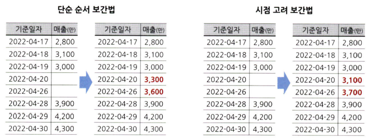
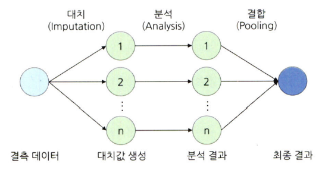
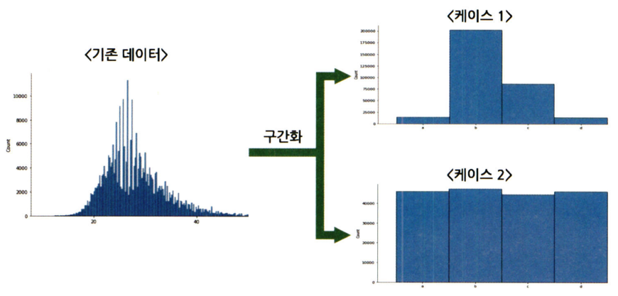
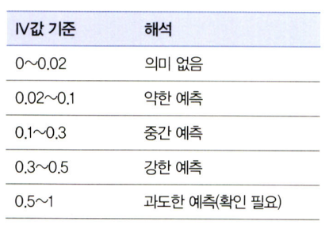
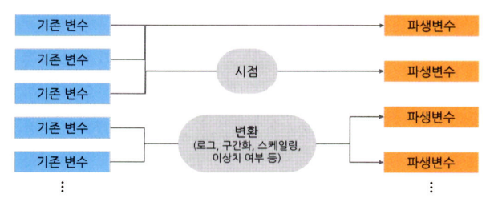

# 통계학 5주차 정규과제

📌통계학 정규과제는 매주 정해진 분량의 『*데이터 분석가가 반드시 알아야 할 모든 것*』 을 읽고 학습하는 것입니다. 이번 주는 아래의 **Statistics_5th_TIL**에 나열된 분량을 읽고 `학습 목표`에 맞게 공부하시면 됩니다.

아래의 문제를 풀어보며 학습 내용을 점검하세요. 문제를 해결하는 과정에서 개념을 스스로 정리하고, 필요한 경우 추가자료와 교재를 다시 참고하여 보완하는 것이 좋습니다.

5주차는 `2부. 데이터 분석 준비하기`를 읽고 새롭게 배운 내용을 정리해주시면 됩니다.


## Statistics_5th_TIL

### 2부. 데이터 분석 준비하기
### 11.데이터 전처리와 파생변수 생성


## Study Schedule

|주차 | 공부 범위     | 완료 여부 |
|----|----------------|----------|
|1주차| 1부 p.2~56     | ✅      |
|2주차| 1부 p.57~79    | ✅      | 
|3주차| 2부 p.82~120   | ✅      | 
|4주차| 2부 p.121~202  | ✅      | 
|5주차| 2부 p.203~254  | ✅      | 
|6주차| 3부 p.300~356  | 🍽️      | 
|7주차| 3부 p.357~615  | 🍽️      | 

<!-- 여기까진 그대로 둬 주세요-->

# 11.데이터 전처리와 파생변수 생성

```
✅ 학습 목표 :
* 결측값과 이상치를 식별하고 적절한 방법으로 처리할 수 있다.
* 데이터 변환과 가공 기법을 학습하고 활용할 수 있다.
* 모델 성능 향상을 위한 파생 변수를 생성하고 활용할 수 있다.
```

## 11.1. 결측값 처리
<!-- 새롭게 배운 내용을 자유롭게 정리해주세요. -->
- **완전 무작위 결측(MCAR: Missing Completely at Random)**: 이름 그대로 순수하게 결측값이 무작위로 발생한 경우
- **무작위 결측(MAR: Missing at Random)**: 다른 변수의 특성에 의해 해당 변수의 결측치가 체계적으로 발생한 경우
- **비무작위 결측(NMAR: Missing at Not Random)**: 결측값들이 해당 변수 자체의 특성을 갖고 있는 경우

=> 가장 간단한 결측값 처리 방법은 결측값이 심하게 많은 변수를 제거하거나 결측값이 포함된 행을 제외하고 데이터 분석을 하는 표본 제거 방법을 사용하는 것

- **평균 대치법(Mean Imputation)**: 결측값을 제외한 온전한 값들의 평균을 구한 다음, 그 평균 값을 결측값들에 대치하는 것
    - 유사한 방법으로 최빈값, 중앙값, 최댓값, 최솟값 대치도 있음
- **보간법(Interpolation)**: 데이터가 시계열적 특성을 가지고 있을 때 전 시점 혹은 다음 시점의 값으로 대치하거나 전 시점과 다음 시점의 평균 값으로 대치하는 방법



=> 해당 변수와 다른 변수 사이의 관계성을 고려하여 결측값을 계산하면 보다 합리적으로 결측값 처리할 수 있음

- **회귀 대치법(regression imputation)**: 회귀식을 이용하여 결측값을 추정하는 방법
- **확률적 회귀대치법(stochastic regression imputation)**: 회귀식을 활용해 결측값을 추정할 때, 예측값에 무작위 오차항을 추가하여 원자료의 변동성을 그대로 유지하도록 보정하는 기법
- **다중 대치법(multiple imputation)**: 단순대치를 여러 번 수행하여 n개의 가상적 데이터를 생성하여 이들의 평균으로 결측값을 대치하는 방법
    - **대치 단계(Imputations step)**: 가능한 대치 값의 분포에서 추출된 서로 다른 값으로 결측치를 처리한 n개의 데이터셋 생성
    - **분석 단계(Analysis step)**: 생성된 각각의 데이터셋을 분석하여 모수의 추정치와 표준오차 계산
    - **결합 단계(Pooling step)**: 계산된 각 데이터셋의 추정치와 표준오차를 결합하여 최종 결측 대치값 산출




## 11.2. 이상치 처리
<!-- 새롭게 배운 내용을 자유롭게 정리해주세요. -->
> **이상치**란 일부 관측치의 값이 전체 데이터의 범위에서 크게 벗어난 아주 작거나 큰 극단적인 값을 갖는 것

=> 전체 데이터의 양이 많을수록 튀는 값이 통곗값에 미치는 영향력이 줄어들어 이상치 제거의 필요성이 낮아짐

**이상치 처리 방법**
```
- 이상치를 결측값으로 대체한 다음 결측값 처리
- 이상치를 제거
- 관측값 변경(하한 값과 상한 값을 결정한 후 하한 값보다 작으면 하한 값으로 대체하고 상한 값보다 크면 상한값으로 대체)
- 가중치 조정(이상치의 영향을 감소시키는 가중치를 줌)
```

- 평균은 이상치에 통계량이 민감하게 변하기 때문에, 이상치에 보다 강건한 **중위수와 중위수 절대 편차**을 사용하는 것이 좀 더 효과적임
- 분석 도메인에 따라 이상치가 중요한 분석 요인일 수 있음


## 11.3. 변수 구간화
<!-- 새롭게 배운 내용을 자유롭게 정리해주세요. -->
> **변수 구간화(Binning)**<br>
=> 데이터 분석의 성능을 향상시키기 위해서 혹은 해석의 편리성을 위해 이산형 변수를 범주형 변수로 변환함 



=> 이산형 변수를 범주형 변수로 비즈니스적 상황에 맞도록 변화시킴으로써 데이터의 해석이나 예측, 분류 모델을 의도에 맞도록 유도함

**1. 연속형 변수의 구간화**
```
동일 폭 분할 (Equal‐width discretization)
=> 일정한 구간 폭(예: 10)으로 구간을 나눔

동일 빈도 분할 (Equal‐frequency discretization)
=> 각 구간에 속하는 관측치 개수가 같도록(또는 비슷하도록) 구간을 나눔
```

**2. 구간별 평활화 기법**
```
구간 평균값 대체 (Mean Smoothing)
=> 각 값 → 자신이 속한 구간의 평균(mean)으로 대체

구간 중앙값 대체 (Median Smoothing)
=> 각 값 → 자신이 속한 구간의 중앙값(median)으로 대체

경계값 대체 (Boundary Smoothing)
=> 각 값 → 자신이 속한 구간의 최솟값 또는 최댓값 중, 해당 값에 더 가까운 경계값으로 대체
=> 구간 내 위치에 따라 하한(lower bound) 또는 상한(upper bound) 중 하나로 치환
```

---
변숫값이 효과적으로 구간화됐는지는 **WOE(Weight of Evidence)값**, **IV(Information Value)값** 등을 통해 측정할 수 있음



=> 변수가 종족변수를 제대로 설명할 수 있도록 구간화가 잘되면 **IV값이 높아짐**


## 11.4. 데이터 표준화와 정규화 스케일링
<!-- 새롭게 배운 내용을 자유롭게 정리해주세요. -->
- 독립 변수들이 서로 단위가 다르거나 편차가 심할 때 값의 스케일을 일정한 수준으로 변환시켜주는 **표준화(Standardization)와 정규화(Normalization) 스케일링**을 함
    - **표준화**: 각 관측치의 값이 전체 평균을 기준으로 어느 정도 떨어져 있는지 나타낼 때 사용함
    $$z = \frac{x - \mu}{\sigma}$$
    - **정규화**: 데이터의 범위를 0부터 1까지로 변환하여 데이터 분포를 조정하는 방법
    $$x_{\mathrm{scaled}} = \frac{x - x_{\min}}{x_{\max} - x_{\min}}$$

- 이 외에 기본 표준화, 정규화 방식은 이상치에 민감하다는 단점을 보완한 스케일링 기법인 **RobustScaler**도 많이 쓰임
    - 각 특징값의 중앙값(Q2)을 0으로, 1사분위수(Q1)와 3사분위수(Q3) 사이의 IQR(interquartile range)을 1로 맞추어 스케일링하는 기법
    $$x_{\mathrm{scaled}} \;=\; \frac{x - Q_{2}}{Q_{3} - Q_{1}}$$


## 11.5. 모델 성능 향상을 위한 파생 변수 생성
<!-- 새롭게 배운 내용을 자유롭게 정리해주세요. -->
> **파생변수**는 원래 있던 변수들을 조합하거나 함수를 적용하여 새로 만들어낸 변수를 뜻함



- 파생변수는 데이터의 특성을 이용하여 분석 효율을 높이는 것이기 때문에 전체 데이터에 대한 파악이 중요할 뿐만 아니라 **해당 비즈니스 도메인에 대한 충분한 이해가 수반되어야 함**
- 파생변수는 기존의 변수를 활용해서 만들어 낸 변수이기 때문에 **다중공선성 문제가 발생할 가능성이 높음**
- 따라서 파생변수를 만든 다음에는 **상관분석을 통해 변수 간의 상관성을 확인**해야 함


# 확인 문제

## 문제 1. 데이터 전처리

> **🧚 한 금융회사의 대출 데이터에서 `소득` 변수에 결측치가 포함되어 있다. 다음 중 가장 적절한 결측치 처리 방법은 무엇인가?**

> **[보기]   
1️⃣ 결측값이 포함된 행을 모두 제거한다.  
2️⃣ 결측값을 `소득` 변수의 평균값으로 대체한다.  
3️⃣ `연령`과 `직업군`을 독립변수로 사용하여 회귀 모델을 만들어 `소득` 값을 예측한다.  
4️⃣ 결측값을 보간법을 이용해 채운다.**

> **[데이터 특징]**     
    - `소득` 변수는 연속형 변수이다.  
    - 소득과 `연령`, `직업군` 간에 강한 상관관계가 있다.  
    - 데이터셋에서 `소득` 변수의 결측 비율은 15%이다.

```
3️⃣ 회귀 모델 기반 대치법
→ 소득이 연령 및 직업군과 높은 상관관계를 보이므로, 이 관계를 이용해 회귀 모델을 학습한 뒤 해당 모델로 결측 소득을 예측·대체함
```

## 문제 2. 데이터 스케일링

> **🧚 머신러닝 모델을 학습하는 과정에서, `연봉(단위: 원)`과 `근속연수(단위: 년)`를 동시에 독립변수로 사용해야 합니다. 연봉과 근속연수를 같은 스케일로 맞추기 위해 어떤 스케일링 기법을 적용하는 것이 더 적절한가요?**

<!--표준화와 정규화의 차이점에 대해 고민해보세요.-->

```
표준화
→ 연봉과 근속연수의 단위·범위 차이를 해소하고 이상치 영향을 줄이기 위해 Z-score 표준화를 적용하는 것이 적절함
```

### 🎉 수고하셨습니다.