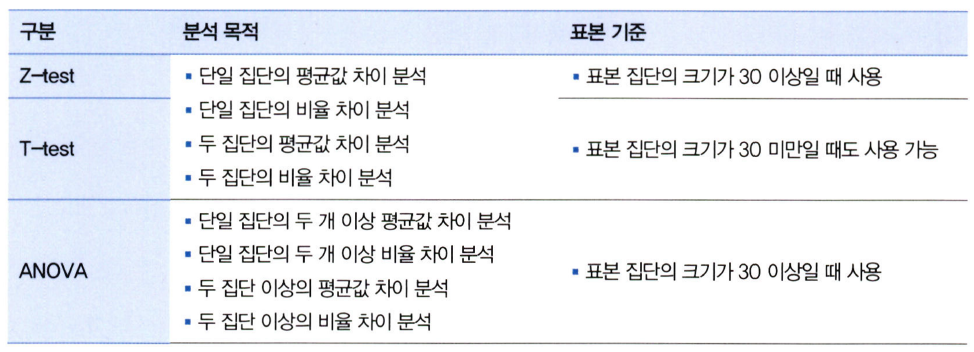

# 통계학 6주차 정규과제

📌통계학 정규과제는 매주 정해진 분량의 『*데이터 분석가가 반드시 알아야 할 모든 것*』 을 읽고 학습하는 것입니다. 이번 주는 아래의 **Statistics_6th_TIL**에 나열된 분량을 읽고 `학습 목표`에 맞게 공부하시면 됩니다.

아래의 문제를 풀어보며 학습 내용을 점검하세요. 문제를 해결하는 과정에서 개념을 스스로 정리하고, 필요한 경우 추가자료와 교재를 다시 참고하여 보완하는 것이 좋습니다.

6주차는 `3부. 데이터 분석하기`를 읽고 새롭게 배운 내용을 정리해주시면 됩니다.


## Statistics_6th_TIL

### 3부. 데이터 분석하기
### 12.통계 기반 분석 방법론


## Study Schedule

|주차 | 공부 범위     | 완료 여부 |
|----|----------------|----------|
|1주차| 1부 p.2~56     | ✅      |
|2주차| 1부 p.57~79    | ✅      | 
|3주차| 2부 p.82~120   | ✅      | 
|4주차| 2부 p.121~202  | ✅      | 
|5주차| 2부 p.203~254  | ✅      | 
|6주차| 3부 p.300~356  | ✅      | 
|7주차| 3부 p.357~615  | 🍽️      |

<!-- 여기까진 그대로 둬 주세요-->

# 12.통계 기반 분석 방법론

```
✅ 학습 목표 :
* 주성분 분석(PCA)의 개념을 설명할 수 있다.
* 다중공선성을 진단할 수 있다.
* Z-TEST와 T-TEST의 개념을 비교하고, 적절한 상황에서 검정을 설계하고 수행할 수 있다.
* ANOVA TEST를 활용하여 세 개 이상의 그룹 간 평균 차이를 검정하고, 사후검정을 수행할 수 있다.
* 카이제곱 검정을 통해 범주형 변수 간의 독립성과 연관성을 분석하는 방법을 설명할 수 있다.
```

## 12.1. 분석 모델 개요
<!-- 새롭게 배운 내용을 자유롭게 정리해주세요.-->
**통계학에 기반한 통계 모델**<br>
=> 모형과 해석을 중요하게 생각하며, 오차와 불확정성을 강조

**인공지능에서 파생된 기계 학습**<br>
=> 대용량 데이터를 활용하여 예측의 정확도를 높이는 것을 중요하게 생각함


**기계 학습 데이터 분석 방법론**


- 종속변수의 유무 => 지도학습/비지도학습/강화학습
- 독립변수와 종속변수의 속성에 따라 방법론이 결정됨
    - 하나의 방법론이 양적, 질적 변수 형태에 모두 사용가능한 경우도 있음

```
- 지도학습: 입력에 대한 정답이 주어져서 출력된 결괏값과 정답 사이의 오차가 줄어들도록 학습과 모델 수정을 반복함

- 비지도학습(자율학습): 별도의 정답이 없이 변수 간의 패턴을 파악하거나 데이터를 군집화하는 방법

- 강화학습: 동물이 시행착오를 통해 학습하는 과정을 기본 콘셉트로 한 방법 중 하나
```


## 12.2. 주성분 분석(PCA)
<!-- 새롭게 배운 내용을 자유롭게 정리해주세요.-->
> 여러 개의 독립변수들을 잘 설명해 줄 수 있는 주된 성분을 추출하는 기법

**차원의 저주:**<br>
- 변수가 늘어남에 따라 차원이 커지면서 분석을 위한 최소한의 필요 데이터 건수가 늘어나면서 예측이 불안정해지는 문제

**차원을 감소하는 방법**
1. 변수 선택을 통해 비교적 불필요하거나 유의성이 낮은 변수를 제거하는 방법
2. 변수들의 잠재적인 성분을 추출하여 차원을 줄이는 방법

- 일반적으로는 제1주성분, 제2주성분만으로 대부분의 설명력이 포함되기 때문에 두 개의 주성분만 선정함


=> 이처럼 해당 차원의 가장 많은 분산을 담아내는 축이 '주성분'이 되는 것임


=> 각 포인트들이 직각으로 맞닿는 지점의 분포가 가장 넓게 퍼진 축을 구하는 것


=> 예시는 2차원, 즉 변수가 두 개이기 때문에 최대 2개의 주성분을 만들 수 있음

**주성분의 설명력**


## 12.4. 다중공선성 해결과 섀플리 밸류 분석
<!-- 새롭게 배운 내용을 자유롭게 정리해주세요.-->
> **다중공선성** => 독립변수들 간의 상관관계가 높은 현상, 즉 두 개 이상의 독립변수가 서로 선형적인 관계를 나타낼 때

**다중공선성을 판별하는 기준**
1. 회귀분석 모델을 실행하기 전에 상관분석을 통해 독립 변수 간의 상관성을 확인하여 높은 상관계수를 갖는 독립변수를 찾아내는 방법
2. 회귀분석 결과에서 독립변수들의 설명력을 의미하는 결정계수 $R^2$값은 크지만 회귀계수에 대한 t값이 낮다면 다중공선성을 의심해 볼 수 있음
3. VIF(Variance Inflation Factor), 즉 분산팽창계수를 통해 다중공선성을 판단할 수 있음

**다중공선성을 해결하기 위한 방법**<br>
=> VIF값이 높은 변수들 중에서 종속변수와의 상관성(설명력)이 가장 낮은 변수를 제거하고 다시 VIF값을 확인하는 것을 반복하는 것<br>
=> 표본 관측치를 추가적으로 확보하여 다중공선성을 완화하는 방법<br>
=> 변수를 가공하여 변수 간의 상관성을 줄이는 방법<br>
=> 주성분분석을 통해서도 다중공선성을 해결할 수 있음<br>
=> 데이터 분석 환경에서 제공하는 변수 선택 알고리즘을 활용하는 방법

### 섀플리 밸류란?

```
- 어떤 여러 명의 플레이어가 함께 협력해서 가치를 만들어냈을 때, 그 총 가치를 각 구성원에게 공정하게 분배하려면 어떻게 해야 할까?

모델이 어떤 샘플에 대해 특정 예측을 했을 때
=> 해당 예측에서 각 feature가 얼마나 영향을 끼쳤는가?

예를 들어, 모델이 “이 고객은 이탈할 것이다”라고 예측했을 때,
나이, 계약 기간, 이용 요금 등 각각의 feature가 예측값에 얼마나 기여했는가?를 수치로 알려줌
```


## 12.6. Z-test와 T-test
<!-- 새롭게 배운 내용을 자유롭게 정리해주세요.-->

- 단일 표본 집단의 평균 변화를 분석하거나 두 집단의 평균값 혹은 비율 차이를 분석할 때 사용
- 분석하고자 하는 변수가 양적 변수이며, 정규 분포이며, 등분산이라는 조건이 충족되어야 함




## 12.7. ANOVA
<!-- 새롭게 배운 내용을 자유롭게 정리해주세요.-->
- 세 집단 이상의 평균 차이를 검정할 때 사용
- 독립변수인 요인의 수에 따라서 다르게 불림
    - 일원 분산분석/이원 분산분석/N원 분산분석
- 각 집단의 평균값 차이가 통계적으로 유의한지 검증함


## 12.8. 카이제곱 검정(교차분석)
<!-- 새롭게 배운 내용을 자유롭게 정리해주세요.-->
> 교차분석이라고도 불리며, 명목 혹은 서열척도와 같은 범주형 변수들 간의 연관성을 분석하기 위해 결합분포를 활용하는 방법


# 확인 문제

### **문제 1.**
> **🧚 경희는 다트비 교육 연구소의 연구원이다. 경희는 이번에 새롭게 개발한 교육 프로그램이 기존 프로그램보다 학습 성취도 향상에 효과적인지 검증하고자 100명의 학생을 무작위로 두 그룹으로 나누어 한 그룹(A)은 새로운 교육 프로그램을, 다른 그룹(B)은 기존 교육 프로그램을 수강하도록 하였다. 실험을 시작하기 전, 두 그룹(A, B)의 초기 시험 점수 평균을 비교한 결과, 유의미한 차이가 없었다. 8주 후, 학생들의 최종 시험 점수를 수집하여 두 그룹 간 평균 점수를 비교하려고 한다.**   

> **🔍 Q1. 이 실험에서 사용할 적절한 검정 방법은 무엇인가요?**

```
두 독립집단의 평균 차이를 비교하므로 독립표본 t-검정을 사용한다.
```

> **🔍 Q2. 이 실험에서 설정해야 할 귀무가설과 대립가설을 각각 작성하세요.**

```
- 귀무가설(H₀): 새로운 교육 프로그램(A)과 기존 프로그램(B) 간 성취도 평균에 차이가 없다.
- 대립가설(H₁): 두 프로그램 간 성취도 평균에 차이가 있다.
```

> **🔍 Q3. 검정을 수행하기 위한 절차를 순서대로 서술하세요.**

<!--P.337의 실습 코드 흐름을 확인하여 데이터를 불러온 후부터 어떤 절차로 검정을 수행해야 하는지 고민해보세요.-->

```
1. 두 그룹(A, B)의 최종 시험 점수 데이터를 불러온다.
2. 각 그룹의 평균 및 분산을 확인하고 시각화한다.
3. 정규성 검정을 실시한다.
4. 등분산성 검정을 실시한다.
5. 조건에 따라 독립표본 t-검정을 수행한다.
   - 등분산 가정 충족 시: Student’s t-test
   - 등분산 가정 불충족 시: Welch’s t-test
6. p-value를 확인하여 유의수준(예: 0.05)과 비교해 귀무가설 기각 여부를 판단한다.
```

> **🔍 Q4. 이 검정을 수행할 때 가정해야 하는 통계적 조건을 설명하세요.**

```
1. 각 집단의 데이터는 정규분포를 따른다 (정규성).
2. 두 집단은 서로 독립적이다 (독립성).
3. 두 집단의 분산이 동일하다고 가정한다 (등분산성).
```

> **🔍 Q5. 추가적으로 최신 AI 기반 교육 프로그램(C)도 도입하여 기존 프로그램(B) 및 새로운 프로그램(A)과 비교하여 성취도 차이가 있는지 평가하고자 한다면 어떤 검정 방법을 사용해야 하나요? 단, 실험을 시작하기 전, C 그룹의 초기 점수 평균도 A, B 그룹과 유의미한 차이가 없었다고 가정한다.**

```
세 집단(A, B, C) 간 평균 차이를 비교하므로 일원분산분석을 사용한다.
```

> **🔍 Q6. 5번에서 답한 검정을 수행한 결과, 유의미한 차이가 나타났다면 추가적으로 어떤 검정을 수행해 볼 수 있을까요?**

```
사후 분석(Post-hoc test)을 수행할 수 있다.
- Tukey의 HSD 검증이나 Scheffe 검증 방법 등을 사용하여 유의수준 안에 부집단을 구별한다.
```

---
### **문제 2. 카이제곱 검정**  
> **🧚 다음 중 어떠한 경우에 카이제곱 검정을 사용해야 하나요?   
1️⃣ 제품 A, B, C의 평균 매출 차이를 비교하고자 한다.  
2️⃣ 남성과 여성의 신체 건강 점수 평균 차이를 분석한다.  
3️⃣ 제품 구매 여부(구매/미구매)와 고객의 연령대(10대, 20대, 30대…) 간의 연관성을 분석한다.  
4️⃣ 특정 치료법이 환자의 혈압을 감소시키는 효과가 있는지 확인한다.**  

```
3️⃣ 제품 구매 여부(구매/미구매)와 고객의 연령대(10대, 20대, 30대…) 간의 연관성을 분석한다.

두 범주형 변수 간의 독립성(연관성)을 분석하는 데 카이제곱 검정을 사용한다.
```

### 🎉 수고하셨습니다.