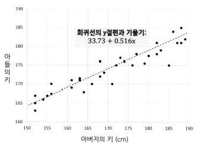
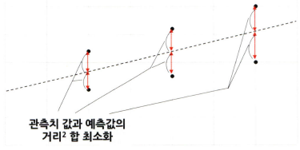
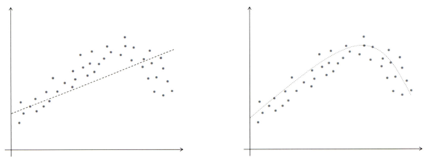
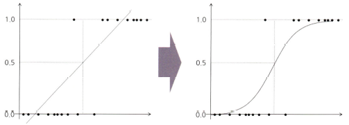
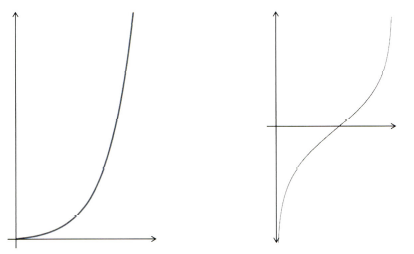
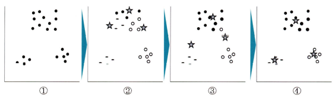
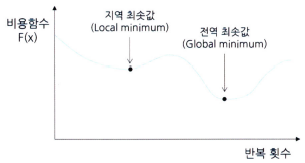
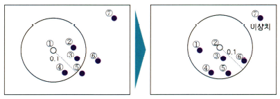

# 통계학 7주차 정규과제

📌통계학 정규과제는 매주 정해진 분량의 『*데이터 분석가가 반드시 알아야 할 모든 것*』 을 읽고 학습하는 것입니다. 이번 주는 아래의 **Statistics_7th_TIL**에 나열된 분량을 읽고 `학습 목표`에 맞게 공부하시면 됩니다.

아래의 문제를 풀어보며 학습 내용을 점검하세요. 문제를 해결하는 과정에서 개념을 스스로 정리하고, 필요한 경우 추가자료와 교재를 다시 참고하여 보완하는 것이 좋습니다.

7주차는 `3부. 데이터 분석하기`를 읽고 새롭게 배운 내용을 정리해주시면 됩니다.


## Statistics_7th_TIL

### 3부. 데이터 분석하기
### 13.머신러닝 분석 방법론
### 14.모델 평가


## Study Schedule

|주차 | 공부 범위     | 완료 여부 |
|----|----------------|----------|
|1주차| 1부 p.2~56     | ✅      |
|2주차| 1부 p.57~79    | ✅      | 
|3주차| 2부 p.82~120   | ✅      | 
|4주차| 2부 p.121~202  | ✅      | 
|5주차| 2부 p.203~254  | ✅      | 
|6주차| 3부 p.300~356  | ✅      | 
|7주차| 3부 p.357~615  | ✅      | 

<!-- 여기까진 그대로 둬 주세요-->

# 13.머신러닝 분석 방법론

```
✅ 학습 목표 :
* 선형 회귀와 다항 회귀를 비교하고, 데이터를 활용하여 적절한 회귀 모델을 구축할 수 있다. 
* 로지스틱 회귀 분석의 개념과 오즈(Odds)의 의미를 설명하고, 분류 문제에 적용할 수 있다.
* k-means 알고리즘의 원리를 설명하고, 적절한 군집 개수를 결정하여 데이터를 군집화할 수 있다.
```

## 13.1. 선형 회귀분석과 Elastic Net(예측모델)
<!-- 새롭게 배운 내용을 자유롭게 정리해주세요.-->
<!-- `13.1.3. Ridge와 Lasso 그리고 Elastic Net` 부분은 제외하고 학습하셔도 무방합니다.-->

### 13.1.1 회귀분석의 기원과 원리
> **회귀분석**은 프랜시스 골턴이 부모의 키와 자식의 키에 대한 유전 법칙을 연구하다 시작됨



- 종속변수 Y의 값에 영향을 주는 독립변수 X들의 조건을 고려하여 구한 평균값

$$y = \beta_0 + \beta_1 X_1 + \cdots + \beta_n X_n + \varepsilon$$

- 예측치와 관측치들 간의 수직 거리(오차)의 제곱합을 최소로 하는 직선이 회귀선이 됨 => **최소제곱추정법(Least squares estimation)**



> - **잔차의 정규성:** X(독립변수)에 해당되는 Y(종속변수)의 값들의 잔차는 정규분포를 해야 한다.
> - **잔차의 등분산성:** 잔차의 분산은 회귀 모형의 독립 변숫값과 상관없이 일정해야 한다.
> - **독립성:** 독립변수들 간에 상관관계가 없어야 한다. (다중 선형회귀)
> - **선형성:** X(독립변수) 값의 변화에 따른 Y(종속변수) 값의 변화는 일정해야 한다.

### 13.1.2 다항 회귀
> **다항회귀**란 독립변수와 종속변수의 관계가 곡선형 관계일 때 변수에 각 특성의 제곱을 추가하여 회귀선을 곡선형으로 변환하는 모델

=> 차수가 커질수록 편향은 감소하지만 변동성이 증가하게 됨에 따라서 분산이 늘어나고 과적합을 유발할 수 있음



| 항목            | 설명                                  |
|-----------------|---------------------------------------|
| 회귀계수        | 독립변수의 영향력                    |
| 표준오차        | 회귀계수의 추정 불확실성             |
| T 값            | 회귀계수의 크기/불확실성 비율        |
| P 값            | 유의성 판단 기준 (보통 0.05 기준)    |
| Tolerance & VIF | 다중공선성 확인 지표                 |

### 변수 선택 알고리즘
> - **전진 선택법:** 가장 단순한 변수선택법으로, 절편만 있는 모델에서 시작하여 유의미한 독립변수 순으로 변수를 차례로 하나씩 추가하는 방법
> - **후진 제거법:** 모든 독립변수가 포함된 상태에서 시작하여 유의미하지 않는 순으로 설명변수를 하나씩 제거하는 방법
> - **단계적 선택법:** 전진 선택법과 후진 제거법의 장점을 더한 방법


## 13.2. 로지스틱 회귀분석 (분류모델)
<!-- 새롭게 배운 내용을 자유롭게 정리해주세요.-->
> 특정 수치를 예측하는 것이 아니라 어떤 카테고리에 들어갈지 분류를 하는 모델



### 로지스틱 회귀의 필요성
- **선형 회귀**는 예측값이 0~1 범위를 벗어날 수 있어 확률로 해석이 어려움.
- 확률 값을 0~1 사이로 제한하기 위해 **로지스틱 회귀** 사용
- 선형 회귀 → 확률 변환 → **오즈(odds)** → **로그 오즈(log odds)**로 변환하여 모델링

### 오즈와 로그 오즈의 의미
- **오즈**: 사건이 발생할 확률 vs 발생하지 않을 확률의 비율  
  $$
  \text{Odds} = \frac{P(\text{event})}{1 - P(\text{event})}
  $$
- 오즈가 클수록 사건 발생 가능성이 높음
- **로그 오즈**: 오즈에 로그 씌운 값 → 직선 형태 함수로 변환 가능



### 로지스틱 회귀의 수식
- **시그모이드(Sigmoid)** 함수 사용 → 확률을 0~1로 제한:
  $$
  P = \frac{1}{1 + e^{-(\beta_0 + \beta_1 X)}}
  $$
- 독립변수(X)의 변화에 따른 **사건 발생 확률(P)** 예측 가능

### 다항 로지스틱 회귀
- 종속변수가 **3개 이상**일 경우 사용.
- 기준 범주(D)와 나머지 범주(A, B, C 등) 비교하여 로그 오즈 방정식 구성:
  $$
  \log\left(\frac{P(A)}{P(D)}\right), \quad
  \log\left(\frac{P(B)}{P(D)}\right), \quad
  \log\left(\frac{P(C)}{P(D)}\right)
  $$
- **K개의 범주** → K-1개의 방정식 필요.


## 13.8. k-means 클러스터링(군집모델)
<!-- 새롭게 배운 내용을 자유롭게 정리해주세요.-->
> 중심점과 군집  내 관측치 간의 거리를 비용함수로 하여, 이 함수 값이 최소화되도록 중심점과 군집을 반복적으로 재정의해줌

- **1단계:** k개의 중심점을 임의의 데이터 공간에 선정
- **2단계:** 각 중심점과 관측치들 간의 유클리드 거리를 계산
- **3단계:** 각 중심점과 거리가 가까운 관측치들을 해당 군집으로 할당
- **4단계:** 할당된 군집의 관측치들과 해당 중심점과의 유클리드 거리를 계산
- **5단계:** 중심점을 군집의 중앙으로 이동(군집의 관측치들 간 거리 최소 지점)
- **6단계:** 중심점이 더 이상 이동하지 않을 때까지 2~5단계 반복



- 초기에 중심점이 잘못 설정되면, 실제로는 최적의 클러스터링이 아님에도 수렴해버리는 문제 => **지역 최솟값 문제**



=> K-means는 중심점과 관측치 간 거리의 제곱합을 최소화하는 방식<br>
=> 이 비용함수는 반복 수행을 통해 수렴하지만, **전역 최솟값**이 아닐 수 있음

### K값 설정 방법
- **엘보우 기법:** 군집 내 중심점과 관측치 간 거리 합이 급감하는 구간의 k 개수를 선정하는 방법
- **실루엣 계수:** 군집 안의 관측치들이 다른 군집과 비교해서 얼마나 비슷한지를 나타내는 수치

### DBSCAN (Density-Based Spatial Clustering)
- 밀도 기반 군집화 알고리즘으로, **거리 기준(epsilon)**과 최소 이웃 수(minPts) 설정이 필요
- 밀도 높은 영역은 클러스터로 인식, 밀도 낮은 영역은 이상치(Noise)로 처리

> - **Core Point:** 주위에 minPts 이상 이웃이 있는 점
> - **Border Point:** Core에는 속하지 않지만 Core 주변에 있는 점
> - **Noise Point:** 어떤 군집에도 속하지 않는 점



### K-means vs DBSCAN 비교
- **K-means**는 속도 빠르고 해석이 쉬우나 단순 구조에 적합
- **DBSCAN**은 복잡한 형태와 이상치 탐지에 유리하지만, 파라미터 설정이 어려움


# 14. 모델 평가

```
✅ 학습 목표 :
* 유의확률(p-value)을 해석할 때 주의할 점을 설명할 수 있다.
* 분석가가 올바른 주관적 판단을 위한 필수 요소를 식별할 수 있다.
```

## 14.3. 회귀성능 평가지표
<!-- 새롭게 배운 내용을 자유롭게 정리해주세요.-->
### R-Square & Adjusted R-Square

| 항목             | 의미 |
|------------------|------|
| **R² (결정계수)** | 모델이 종속변수의 변동을 얼마나 설명하는지 나타내는 지표 (0~1 사이) |
| **공식**          | $R^2 = 1 - \frac{SSE}{SST}$, $SST = SSR + SSE$ |
| **Adjusted R²**  | 변수 수 증가에 따른 보정된 결정계수<br>$ \text{Adj } R^2 = 1 - \frac{SSE / (T-k)}{SST / (T-1)}$ |

### RMSE (Root Mean Square Error)

- **정의**: 실제값과 예측값의 차이를 제곱하고 평균 낸 뒤 루트를 취한 값
- **특징**: 큰 오차에 민감함, 단위는 종속변수와 같음  
- **공식**:  
  $
  RMSE = \sqrt{ \frac{1}{n} \sum_{i=1}^{n} (y_i - \hat{y}_i)^2 }
  $

### MAE (Mean Absolute Error)

- **정의**: 실제값과 예측값의 **절대 오차 평균**
- **특징**: RMSE보다 이상치에 덜 민감
- **공식**:  
  $
  MAE = \frac{1}{n} \sum_{i=1}^{n} |y_i - \hat{y}_i|
  $

### MAPE (Mean Absolute Percentage Error)

- **정의**: 오차를 실측값 기준으로 **백분율로 표현**한 값
- **특징**:
  - 스케일에 관계없이 비교 가능
  - 실측값이 0에 가까우면 과도한 오차 발생 가능
- **공식**:  
  $
  MAPE = \frac{100}{n} \sum_{i=1}^{n} \left| \frac{y_i - \hat{y}_i}{y_i} \right|
  $

### RMSLE (Root Mean Square Logarithmic Error)

- **정의**: 예측값과 실제값에 로그를 취해 RMSE 계산
- **특징**:
  - 값이 작을수록 오차 작음
  - 저평가에 관대, 고평가에 덜 민감
- **공식**:  
  $
  RMSLE = \sqrt{ \frac{1}{n} \sum_{i=1}^{n} \left( \log(y_i+1) - \log(\hat{y}_i+1) \right)^2 }
  $

---

### 모델 선택 기준: AIC / BIC

#### AIC (Akaike Information Criterion)

| 항목                     | 내용 |
|--------------------------|------|
| **목적**                 | 모델의 적합성과 복잡도를 모두 고려하는 모델 평가 지표 |
| **공식**                 | $AIC = -2 \ln(\text{Likelihood}) + 2k$<br>$k$: 추정된 파라미터 수 (모델 복잡도 반영) |
| **보정된 AIC (AICc)**    | $AIC_c = AIC + \frac{2k(k+1)}{n - k - 1}$ |

#### BIC (Bayesian Information Criterion)

| 항목       | 내용 |
|------------|------|
| **목적**   | AIC보다 더 강하게 복잡한 모델을 제어 (보수적 선택) |
| **공식**   | $BIC = -2 \ln(\text{Likelihood}) + k \ln(n)$<br>$n$: 표본 수 |

#### AIC vs BIC 비교 요약

| 기준          | AIC                              | BIC                                   |
|---------------|-----------------------------------|----------------------------------------|
| 평가 목적     | 예측력 중심                      | 단순 모델 선호                        |
| 패널티 강도   | 약함 (2k)                         | 강함 (k * log(n))                     |
| 작은 표본 수 | AIC 적합                          | BIC 과소적합 가능성 있음             |
| 변수 수 많은 경우 | 더 유연하게 평가 가능            | 변수 수 제한이 중요할 때 적합        |


## 14.6. 유의확률의 함정
<!-- 새롭게 배운 내용을 자유롭게 정리해주세요.-->
> 일반적으로 p < 0.05면 "유의하다"고 판단하지만, 이는 관례일 뿐 절대 기준은 아님

### p-value의 한계

1. **표본 수 증가에 따라 p값은 작아질 수 있음**  
   - 같은 효과라도 표본이 많을수록 p값이 작아짐  
   → 통계적으로 유의하지만 실제로는 **의미 없는 차이일 수 있음**

2. **p값이 작아도 인과관계를 의미하지 않음**  
   - p < 0.05는 단지 **우연히 발생할 확률이 낮다**는 것일 뿐  
   → **인과관계, 효과의 크기, 중요성**을 증명하진 않음

3. **p값에 과도하게 의존하면 잘못된 과학적 결론 유도 가능**  
   - 예: 선택적 보고, 결과 조작(`p-hacking`, `cherry picking`), 출판 편향

### ASA(미국통계학회)의 p-value 관련 6가지 권고 (2016)

| 번호 | 권고 내용 |
|------|-----------|
| 1 | p값은 데이터가 통계 모델과 **얼마나 일치하는지**만을 나타냄 |
| 2️ | p값은 **연구 가설의 진실성이나 효과 크기**를 측정하지 않음 |
| 3️ | p값은 **과학적 판단이나 정책 결정의 유일한 기준이 되어선 안 됨** |
| 4️ | **모든 분석 절차와 가설 검정 방법**을 투명하게 보고해야 함 |
| 5️ | p값 또는 통계적 유의성만으로 **효과의 크기나 중요성**을 추정하지 말 것 |
| 6️ | p값은 **다른 근거들과 함께 포괄적인 판단의 일부로만 사용**되어야 함 |

- p값은 **확률 해석에 주의**가 필요하며, **맥락과 함께 해석**되어야 함
- 단순한 유의성 판단이 아닌  
  **실질적 효과 크기**, **데이터 구조**, **사전 지식**, **베이지안 해석** 등을 함께 고려해야  
  **신뢰 가능한 통계 해석**이 가능함


## 14.7. 분석가의 주관적 판단과 스토리텔링
<!-- 새롭게 배운 내용을 자유롭게 정리해주세요.-->
### 분석에서 인사이트가 중요한 이유
- 단순히 기계학습 알고리즘을 돌려 모델을 만드는 것이 전부가 아님
- 분석가의 해석, 도메인 지식, 사람에 대한 이해가 모델 해석 및 활용에 결정적 영향을 미침

### 분석가에게 필요한 3가지 역량
1. 도메인 지식
- 해당 산업, 시장, 고객 행동에 대한 배경 이해

2. 통계·데이터 분석 지식
- 탐색적 분석(EDA) 및 전체 데이터 흐름 이해

3. 커뮤니케이션/스토리텔링
- 분석 결과를 타인에게 설득력 있게 전달할 수 있어야 함

### 아리스토텔레스의 3막 구조 (스토리 구조화)

| 막        | 구성 요소         | 설명                                 |
|-----------|------------------|--------------------------------------|
| 1막(서론) | 배경 및 문제 제기 | 문제의 심각성, 현황 등 제시           |
| 2막(본론) | 분석 및 해결 과정 | 분석 데이터, 인사이트, 실험 결과 등  |
| 3막(결론) | 결론 및 제안      | 해결책 제시, 향후 전략 등 제안        |

**예시**:
> “5%의 불량률로 연간 100억 손실이 발생하는 A 제품의 공정을, 센서 분석을 통해 불량률을 1%로 개선 → 연간 90억 비용 절감”


# 확인 문제

## **문제 1. 선형 회귀**

> **🧚 칼 피어슨의 아버지와 아들의 키 연구 결과를 바탕으로, 다음 선형 회귀식을 해석하세요.**  
> 칼 피어슨(Karl Pearson)은 아버지(X)와 아들(Y)의 키를 조사한 결과를 바탕으로 아래와 같은 선형 회귀식을 도출하였습니다. 아래의 선형 회귀식을 보고 기울기의 의미를 설명하세요. 
>  
> **ŷ = 33.73 + 0.516X**  
>   
> - **X**: 아버지의 키 (cm)  
> - **ŷ**: 아들의 예상 키 (cm)  

```
본 회귀식은 아버지의 키(X)가 아들의 예상 키(ŷ)에 어떤 영향을 미치는지를 나타냄

여기서 기울기 0.516은 아버지의 키가 1cm 증가할 때, 아들의 예상 키는 평균적으로 0.516cm 증가
즉, 아버지가 더 키가 클수록 아들의 키도 더 클 확률이 높으며, 증가 폭은 1cm당 약 0.516cm
```
---

## **문제 2. 로지스틱 회귀**  

> **🧚 다트비에서는 학생의 학업 성취도를 예측하기 위해 다항 로지스틱 회귀 분석을 수행하였습니다. 학업 성취도(Y)는 ‘낮음’, ‘보통’, ‘높음’ 3가지 범주로 구분되며, 독립 변수는 주당 공부 시간(Study Hours)과 출석률(Attendance Rate)입니다. 단, 기준범주는 '낮음' 입니다.**   

| 변수 | Odds Ratio Estimates | 95% Wald Confidence Limits |  
|------|----------------------|--------------------------|  
| Study Hours | **2.34** | (1.89, 2.88) |  
| Attendance Rate | **3.87** | (2.92, 5.13) |  

> 🔍 Q1. Odds Ratio Estimates(오즈비, OR)의 의미를 해석하세요.

<!--변수 Study Hours의 오즈비 값이 2.34라는 것과 Attendance Rate의 오즈비 값이 3.87이라는 것이 각각 무엇을 의미하는지 구체적으로 생각해보세요.-->

```
Study Hours의 오즈비 2.34는 주당 공부 시간이 1단위 증가할 때, '낮음'에 비해 '보통' 또는 '높음' 학업 성취도를 가질 오즈가 2.34배 증가
Attendance Rate의 오즈비 3.87은 출석률이 1단위 증가할 때, '낮음'에 비해 '보통' 또는 '높음' 학업 성취도를 가질 오즈가 3.87배 증가

→ 출석률이 공부 시간보다 학업 성취도에 더 큰 영향을 미침
```

> 🔍 Q2. 95% Wald Confidence Limits의 의미를 설명하세요.
<!--각 변수의 신뢰구간에 제시된 수치가 의미하는 바를 생각해보세요.-->

```
오즈비의 신뢰구간은 해당 변수의 실제 오즈비가 포함될 것으로 95% 신뢰할 수 있는 구간

Study Hours의 신뢰구간 (1.89, 2.88)은 주당 공부 시간의 오즈비가 95% 확률로 1.89~2.88 사이에 있을 것이라는 의미
Attendance Rate의 신뢰구간 (2.92, 5.13)은 출석률의 오즈비가 95% 확률로 2.92~5.13 사이에 있을 것이라는 의미

→ 두 변수 모두 신뢰구간이 1보다 크므로 통계적으로 유의미한 영향을 가진다고 판단
```

> 🔍 Q3. 이 분석을 기반으로 학업 성취도를 향상시키기 위한 전략을 제안하세요.
<!--Study Hours와 Attendance Rate 중 어느 변수가 학업 성취도에 더 큰 영향을 미치는지를 고려하여, 학업 성취도를 향상시키기 위한 효과적인 전략을 구체적으로 제시해보세요.-->

```
출석률의 오즈비가 더 크므로, 출석률 향상이 학업 성취도 향상에 더 큰 효과를 낼 수 있음

→ 출석률을 높이기 위한 동기부여 프로그램 도입 (예: 보상 시스템, 출석 점수 반영)
```

---

## **문제 3. k-means 클러스터링**

> **🧚 선교는 고객을 유사한 그룹으로 분류하기 위해 k-means 클러스터링을 적용했습니다. 초기에는 3개의 군집으로 설정했지만, 결과가 만족스럽지 않았습니다. 선교가 최적의 군집 수를 찾기 위해 사용할 수 있는 방법을 한 가지 이상 제시하고 설명하세요.**

```
1. 엘보우 기법 (Elbow Method)
- 클러스터 수(K)를 바꾸며 클러스터 내 거리합(Inertia)을 계산하고, 이 값이 급격히 꺾이는 지점을 최적의 K로 선택

2. 실루엣 계수 (Silhouette Score)
- 각 데이터가 자신이 속한 클러스터 내에 얼마나 밀접하게 모여 있는지를 수치화
```

### 🎉 수고하셨습니다.